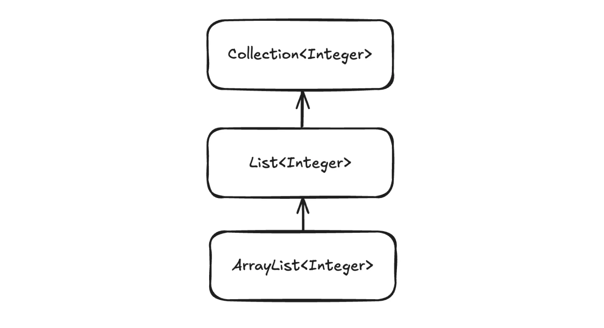
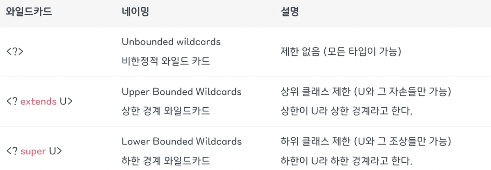
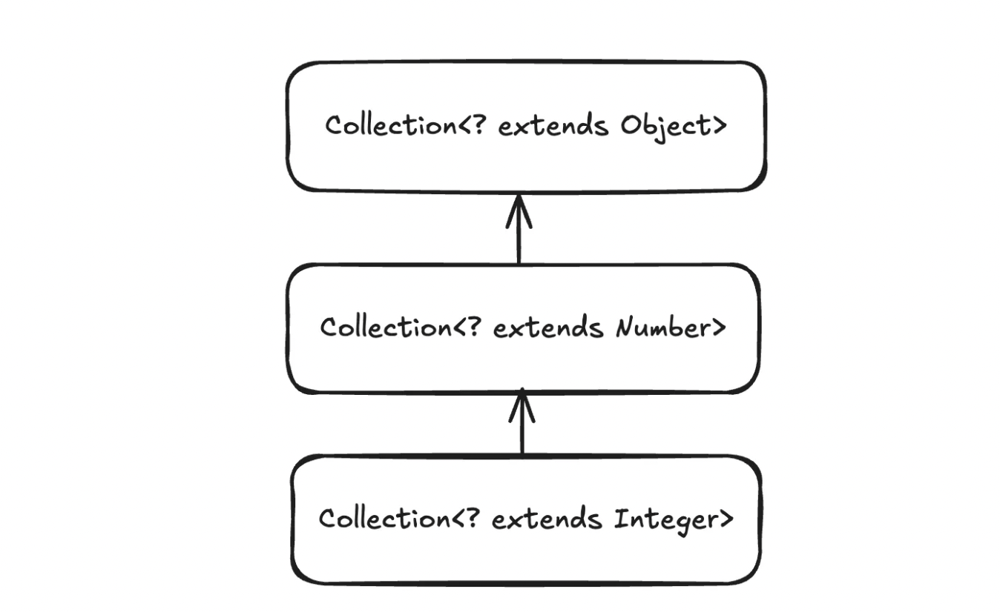
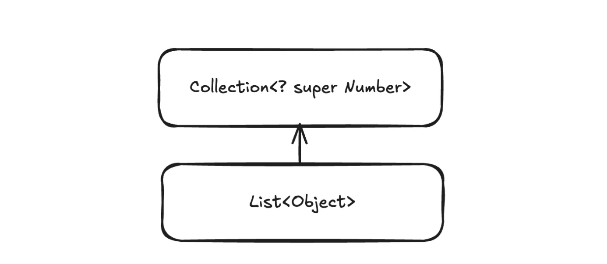

# **공변성과 와일드카드**

## **공변성이란?**

변성이란 타입의 상속 계층 관계에서 타입 간에 어떤 관계가 있는지 나타내는 지표를 말한다. **공변성**은 이 서로 다른 타입 간에 함께 변할 수 있는 특징이다. 객체의 관계로 표현하면 Liskov 치환 원칙에 해당한다.

- 공변
  - S가 T의 하위 타입이면 S[] 는 T[] 의 하위 타입
  - S가 T의 하위 타입이면 List<S>는 List<T>의 하위 타입이다.
- 반공변
  - S가 T의 하위 타입이면 T[] 는 S[] 의 하위 타입이다.
  - List<T>는 List<S>의 하위 타입이다.
- 무공변
  - S와 T는 전혀 상관없고 List<S>는 List<T>와 서로 다른 타입이다.

```java
Object[] arr = new Integer[10]; // 공변성 (업캐스팅)

Integer[] tmp = (Integer[]) arr; // 반공변성 (다운캐스팅)
```

일반적인 상속 관계에서는 공변성을 제공하기 때문에 타입 캐스팅이 가능하다.

하지만 제네릭은 공변성을 제공하지 않아서 <>안의 타입으로 캐스팅이 불가능하다.

공변성이 제공되는 경우



```java
Collection<Integer> parent = new ArrayList<>();
ArrayList<Integer> child = new ArrayList<>();

parent = child;
```

상속관계에서 자유롭게 타입 캐스팅이 가능한 것을 볼 수 있다. (공변성)

공변성이 제공되지 않는 경우


`<>` 안의 타입(제네릭)은 공변성이 제공되지 않는다.

```java
ArrayList<Object> parent = new ArrayList<>();
ArrayList<Integer> child = new ArrayList<>();

parent = child; // 업캐스팅 X
child = parent; // 다운캐스팅 X
```

공변성을 제공하지 않으면 객체지향의 장점을 살리기 어렵다. 파라미터로 넘겨받을 때 캐스팅이 불가능하기 때문에 상위 타입으로 하위 타입을 받을 수 없다. 필요한 모든 타입에 대해서 각각 메서드를 새로 만들어줘야 한다.


위 예제를 실행시키면 `print(List<Object> arr)`  에 매개변수가 들어올 때 컴파일 에러가 발생한다.

- 제네릭 타입 파라미터는 공변성을 제공하지 않기 때문에. (<Integer>, <Object> 타입이 다르다.)

```java
public static void print(List<Integer> arr) {}
public static void print(List<Double> arr) {}
public static void print(List<Number> arr) {}
```

이를 해결하기 위해 위와 같이 메서드를 각각 만들어야 하기 때문에 비효율적이다.

→ 이 문제를 해결하기 위해서 제공하는 기능이 **와일드카드**이다.

## 와일드카드

와일드카드를 이용하면 제네릭을 사용할 때 공변/반공변 속성을 넣을 수 있다.



- 와일드카드 타입을 통해서 공변/반공변성을 지정하는데 타입 매개변수로 지점을 정하는 방식을 **사용지점 변성**이라고 한다.

### 상한 경계 와일드카드 <? extends U> - 공변

<? extends U>의 의미는 U를 포함한 U의 자손 클래스들이 모두 들어올 수 있는 것을 의미한다.

예시)

```java
class MyArrayList<T> {
	Object[] elements = new Object[5];
	int index = 0;
	
	public MyArrayList<Collection<? extends T> in) {
		for (T element : in) {
			elements[index++] = element;
		}
	}	
}
// ----------------
public static void main(String[] args) {
	MyArrayList<Number> list;
	Collection<Integer> col = Arrays.asList(1, 2, 3, 4, 5);
	list = new MyArrayList<>(col);
}
```

MyArrayList<Number>로 생성하고 생성자로 Collection<Integer>를 넘겼다.



위 관계가 성립하기 때문에 Collection<Integer> 타입인 col을 list의 생성자에 넣을 수 있다.

### 하한 경계 와일드카드 <? super U> - 반공변

<? super U>의 의미는 U를 포함한 U의 조상 클래스들이 모두 들어올 수 있는 것을 의미한다.

예시)

```java
class MyArrayList<T> {
	Object[] elements = new Object[5];
	int index = 0;
	
	// T 타입으로 인스턴스화된 클래스보다 더 상위 타입의 데이터를 적재할 때 사용된다.
	public void clone(Collection<? super T> out) {
		for (Object element : elements) {
			out.add((T) element);
		}
	}
}

//------------------
public static void main(String[] args) {
	MyArrayList<Number> list = new MyArrayList<>(Arrays.asList(1, 2, 3, 4, 5));
	
	List<Object> tmp = new LinkedList<>();
	tmp = list.clone(tmp);
}
```

MyArrayList<Number> 타입의 clone 메서드에 List<Object> 타입을 넘겼다.



제네릭 이전에 List는 Collection의 자손이기 때문에 캐스팅되고 <? super Number>이고 Object는 Number의 조상이기 때문에 반공변이 적용되어 정상적으로 동작한다.

- 여기서 List<Object>는 Collection<? super Number>의 하위 타입이 되는 것이다. (반공변)

### 상하한 경계 와일드카드 정리


### 비한정적  와일드카드

extends, super를 사용하지 않고 ?만 사용하면 어떤 타입도 받을 수 있지만 정작 사용하지는 못한다.

```java
public MyArrayList(Collection<?> in) {
	for (T element : in) { // <- ?에 어떤 타입이 들어올지 모르기 때문에 에러 발생.
		elements[index++] = element;
	}
}
```

### 와일드카드 사용

- <? extends U>

GET : 안전하게 꺼내기 위해서 U 타입으로 받아야 한다.

SET : NULL만 삽입 가능하다.

예제)

GET

```java
class FruitBox {
	public static void function(List<? extends Fruit> item) {
		Fruit f1 = item.get(0);
		Apple f2 = (Apple) item.get(0); // ERROR 가능
		Banana f3 = (Banana) item.get(0); // ERROR 가능
	}
}
```

꺼내는 것을 Fruit(U) 타입으로 받지 않으면 에러 가능성이 존재한다. Apple타입으로 가정하고 꺼냈는데 Banana일 수 있다. (형제 관계)

SET

```java
class FruitBox {
	public static void function(List<? extends Fruit> item) {
		item.add(new Fruit()); // ERROR
		item.add(new Apple()); // ERROR
		item.add(new Banana());	// ERROR
	}
}
```

형제 관계의 가능성도 존재하기 때문에 애초에 컴파일 에러로 처리된다.

- <? super U>

GET : 안전하게 꺼내기 위해 Object 타입으로 받아야 한다.

SET : U와 U의 자손 타입만 넣을 수 있다.

예제)

GET

```java
class FruitBox {
	public static void function(List<? super Fruit> item) {
		Object f1 = item.get(0);
		Food f2 = (Food) item.get(0); // ERROR 가능
		Fruit f3 = (Fruit) item.get(0); // ERROR 가능
		Apple f4 = (Apple) item.get(0); // ERROR 가능
		Banana f5 = (Banana) item.get(0); // ERROR 가능
```

?에는 Fruit의 상위 타입이 들어오게 된다. 때문에 Object를 제외한 다른 클래스로 받을 경우 하위 타입으로 상위 타입을 받아서 캐스팅이 불가능한 경우가 발생할 수 있다.

SET

```java
class FruitBox {
	public static void function(List<? super Fruit> item) {
		// Success
		item.add(new Fruit());
		item.add(new Apple());
		item.add(new Banana());
		
		// ERROR
		item.add(new Object());
		item.add(new Food());
	}
}
```

?에는 Fruit을 포함한 하위 타입이 들어온다. 때문에 Fruit이 담을 수 있는 Fruit의 하위 타입만 add할 수 있다.

- ?

GET : 안전하게 꺼내기 위해서 Object 타입으로 받아야 한다.

→ ?에는 어떠한 타입도 들어갈 수 있기 때문에 최상위 타입인 Object로 받아야 한다.

SET : 어떠한 타입의 자료도 넣을 수 없다. (NULL 만 가능)

→ ?가 Object면 모든 타입을 다 넣을 수 있지만 특정 클래스의 하위 타입인 경우 해당 특정 클래스를 add할 수 없기 때문에 사실상 어떠한 값도 넣을 수 없다.

## PECS (Producer-Extends / Consumer-Super)

외부에서 온 데이터를 생산하면 <? extends T> 를 사용

외부에서 온 데이터를 소비하면 <? super T> 를 사용

PE 예제)

```java
class MyArrayList<T> {
	Object[] elements = new Object[5];
	int index = 0;
	
	public MyArrayList(Collection<? extends T> in) {
		for (T element : in) {
			elements[index++] = element;
		}
	}
```

외부에서 들어온 in 데이터를 가지고 MyArrayList<T>를 생성하고 있다.

CS예제)

```java
class MyArrayList<T> {
	Object[] elements = new Object[5];
	int index = 0;
	
	public void clone(Collection<? super T> out) {
		for (Object element : elements) {
			out.add((T) element);
		}
	}
}
```

MyArrayList<T> 내부의 배열을 소비하여 out 리스트에 적재하고 있다.

→ 뇌피셜) 데이터를 생산, 소비한다는 관점이 객체를 중심으로 하는 것 같다. 솔직히 잘 와닿는 설명 방식은 아닌 거 같음.

## In/Out - 오라클 설명

in : 코드에 복사할 데이터를 제공하는 것이 목적 → extends

out : 다른 곳에서 사용할 데이터를 보유 → super

<? extends U> 의 경우 SET이 불가능하고 GET만 가능하다. 즉 제네릭 타입의 매개변수의 데이터를 가져와서 꺼내는 역할로 사용된다.

<? super U> 의 경우 GET은 Object로 가져오기 때문에 의미가 없고, SET만 가능하다. 따라서 제네릭 타입의 매개변수에 값을 적재하는 역할로 사용된다.

## 와일드카드 사용 주의점

1. 클래스나 인터페이스에 제네릭을 설계할 때 와일드카드 사용이 불가능하다.

2. <T extends 타입> 과 <? extends U>의 차이점.

   - <T extends 타입> 은 제네릭 클래스를 설계할 때 사용된다.
   - <? extends U>는 이미 만들어진 제네릭 클래스를 인스턴스화하여 사용할 때 타입 파라미터로 넘길 때 적어주느 것이다.

3. <T super 타입>은 의미가 없다.

   - 제네릭 클래스를 설계할 때 타입 상위의 모든 클래스, 인터페이스가 올 수 있는 것이기 때문에 사실상 Object와 다를바 없다.

4. <?>, <Object>는 다르다.

   - <Object>는 모든 하위 타입을 넣을 수 있지만 <?>의 경우 NULL을 제외하고 add할 수 없다.


## 참고자료

* [https://inpa.tistory.com/entry/JAVA-%E2%98%95-%EC%A0%9C%EB%84%A4%EB%A6%AD-%EC%99%80%EC%9D%BC%EB%93%9C-%EC%B9%B4%EB%93%9C-extends-super-T-%EC%99%84%EB%B2%BD-%EC%9D%B4%ED%95%B4](https://inpa.tistory.com/entry/JAVA-%E2%98%95-%EC%A0%9C%EB%84%A4%EB%A6%AD-%EC%99%80%EC%9D%BC%EB%93%9C-%EC%B9%B4%EB%93%9C-extends-super-T-%EC%99%84%EB%B2%BD-%EC%9D%B4%ED%95%B4)