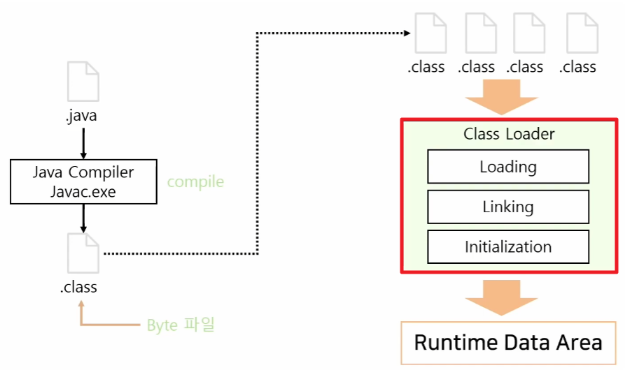
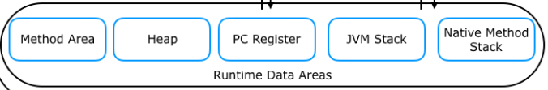

> ### JVM의 클래스 로더

자바의 클래스들이 언제 어디서 메모리에 올라가고 초기화가 되는 지 이해하기 위해선 JVM의 클래스 로더에 대해서 이해할 필요가 있다.

클래스 로더가 하는 업무는 컴파일된 자바의 클래스 파일(*.class)을 동적으로 로드하고, JVM의 메모리 영역인 Runtime Data Areas에 배치하는 
업무이다.

클래스 로더에서 class 파일을 로딩하는 순서는 다음과 같이 3단계로 구성이 된다. (Loading -> Linking -> initialization)

- **Loading(로드)** : 클래스 파일을 가져와서 JVM의 메모리에 로드한다.
- **Linking(링크)** : 클래스 파일을 사용하기 위해 검증하는 과정이다.
  - **Verifying(검증)** : 읽어들인 클래스가 JVM 명세에 명시된 대로 구성되어 있는지 검사한다.
  - **preparing(준비)** : 클래스가 필요로 하는 메모리를 할당한다.
  - **Resolving(분석)** : 클래스의 상수 풀 내 모든 심볼릭 레퍼런스를 다이렉트 레퍼런스로 변경한다.
- **Initialization(초기화)** : 클래스 변수들을 적절한 값으로 초기화한다.



클래스를 메모리에 올리는 Loading 과정은 한번에 메모리에 올라가는 것이 아닌 애플리케이션에서 필요한 시점에 동적으로 메모리에 적재된다.

참고로 static 클래스 멤버들은 소스를 실행하자마자 한번에 메모리에 올라가는 것이 아니라, 실행될 때 필요할 때마다 필요한 클래스를 메모리에 
올림으로써 효율적으로 관리한다.

> ### ※ 동적으로 올라가는 것의 장단점?

장점: 동적으로 메모리가 올라감으로써 얻을 수 있는 가장 큰 장점은 필요한 시점에만 클래스를 로딩함으로써 
사용하지 않는 메모리가 낭비되는 것을 줄일 수 있다.

단점: 런타임 에러는 실행 시점에만 알 수 있다. 또한 동적 로딩에 시간이 필요해서 프로그램 성능이 저하된다.

> ### JVM의 메모리(참고용)
JVM의 메모리 영역은 아래와 같이 5개의 영역으로 나뉜다.
    
- 메서드 영역(코드 영역과 비슷, 상수 풀, 클래스 및 인터페이스 필드, 메서드, 생성자, static 변수, static 메서드 등이 저장)
- 힙 영역(객체와 배열이 할당되는 영역, GC가 동작하는 영역이며, 메서드 영역에서의 참조가 사라지면 GC의 대상이 됨.)
- 스택 영역(메서드 호출 시 지역 변수, 매개변수, 함수 호출 내역 등이 저장되는 영역)
- PC 레지스터(각 스레드 별 현재 수행 중인 JVM 명령의 주소가 저장되는 영역)
- 네이티브 메서드 스택(JAVA가 아닌 C++이나 C 기반의 네이티브 코드가 호출될 때 임시로 생성되었다 사라지는 영역)



---

> ### 코드에서의 클래스 로딩 시점들

### 예시 코드 Outer.java

```java
class Outer {
    static String value = "> Outer 클래스의 static 필드입니다.";
    
    static final String VALUE = "> Outer 클래스의 static final 필드입니다.";
    
    Outer() {
        System.out.println(">Outer 생성자 초기화");
    }
    
    static void getInstance() {
        System.out.println("> Outer 클래스의 static 메서드 호출");
    }
}
```

#### 1. static 멤버들은 사용한 적이 없더라도 메모리에 올라가는가?

static 멤버는 즉시 메모리에 올라가지 않는다. 메인 메서드를 실행하더라도 Main 클래스만 로딩이 되고
직접 가져와 사용하지 않는 경우 해당 클래스는 로드되지 않는다.

따라서, Main이 속한 클래스에서 Outer 클래스가 호출되지 않는다면 static 멤버라도 메모리에 적재되지 않는다.

만약에 호출을 한다고 하면? 해당 멤버 변수는 Outer 클래스 내부에 존재하는 영역이다. 
따라서 이 때에는 Outer 클래스 또한 초기화되어 Method 영역에 올라가게 된다.

#### 2. Outer를 호출한다면?

당연히 Outer 클래스는 Method 영역에 올라가게 된다. 

그럼 이전 예제와 반대로 static 멤버는 어떻게 될 지에 대해 묻는다고 하면 Outer 클래스가 초기화되면서 같이 초기화된다.

#### 3. getInstacne()를 호출한다면?

Outer 클래스가 초기화 되어야지 호출이 가능하므로, Outer 클래스 또한 초기화가 된다.

#### 4. static final로 선언된 VALUE를 호출한다면?

상황에 따라 다르다. 만약에 static final로 된 것들이 0L, 0 같은 숫자거나 String 형태로 된 "자바 스터디" 같은 형태라면
constant pool에서 관리가 되므로 Outer 클래스는 초기화되지 않는다.

하지만 만약에 아래와 같이 클래스 내의 특정 메서드가 로딩되기 위해 클래스도 로딩되어야 하는 경우에는 Outer 클래스도 같이 초기화된다.

```java
static final String VALUE = getName();

static String getName() {
    return "자바 스터디";
}
```

> 따라서 위의 내용을 정리해보면 다음과 같다. 
> 1. static 멤버나 메서드는 바로 실행되기 전에 초기화가 되지 않는다. 실행이 되면 클래스가 초기화되면서 같이 초기화가 된다.
> 2. static final 멤버는 실행하면 별도의 constant pool에서 동작하는 경우 class를 로드하지 않고도 본인만 초기화가 가능하다.
> 3. 반대로 클래스를 생성자 등으로 직접 호출을 하는 경우에는 해당 멤버로 된 것들 또한 메모리에 로드된다.

### 예시 코드 Outer.java와 Inner.java

```java
class Outer {
    static String value = "> Outer 클래스의 static 필드 입니다.";
    
    static final String VALUE = "> Outer 클래스의 static final 필드 입니다.";
    
    Outer() { 
        System.out.println("> Outer 생성자 초기화"); 
    }
  
    static void getInstance() {
        System.out.println("> Outer 클래스의 static 메서드 호출");
    }
    
    class Inner {
        Inner() { System.out.println("> Inner 생성자 초기화"); }
    }
    
    static class Holder {
        static String value = "> Holder 클래스의 static 필드 입니다.";
        static final String VALUE = "> Holder 클래스의 static final 필드 입니다.";
        
        Holder() {
            System.out.println("> Holder 생성자 초기화");
        }
    }
}
```

#### 5. 비정적(non-static) 내부 클래스를 호출한다면?

Inner 클래스인 Inner를 호출한다면? 외부 클래스를 먼저 생성하고 인스턴스화 해야 하기에 Inner 클래스와 Outer 클래스 둘 다 로드가 된다.

이 때, Inner 클래스에서는 this 형태로 Outer 클래스를 참조할 수 있는 주소를 가진다. 그래서 class 파일에 가보면 다음과 같은 코드를 볼 수 있다.

```java
Outer_class$Inner_class(Outer_Class this$0) {
    this.this$0 = this$0;
}
```

위의 코드는 Inner_Class의 생성자 부분으로 외부 클래스를 매개 변수로 받아 인스턴스 변수로 저장을 한다는 의미이다.
따라서, 내부 클래스에 static 없이 선언된 비정적 멤버 클래스의 인스턴스는 바깥 크랠스의 인스턴스와 암묵적으로 연결이 된다는 특징이 있다..
이러한 특징으로 인해서 Inner 클래스가 Outer 클래스를 외부 참조하게 된다. 

즉, Outer 클래스가 필요 없어졌고 Inner 클래스만 필요한 경우에도 Outer 클래스의 참조를 Inner 클래스가 가지고 있기에 Outer 클래스 인스턴스는
GC의 대상이 아니게 되고 결과적으로 Memory leak이 발생한다.

### 6. 정적(static) 내부 클래스를 호출한다면?

static inner 클래스인 Holder를 호출하건 생성하건 inner 클래스는 독립적으로 존재할 수 있다. 따라서, 외부 클래스를 생성하지 않고 로드가 된다.

로딩되고 어떤 것들이 생성되는 기준은 위에서 언급한 Outer만 있는 경우와 사실상 동일하다. 
또한 class 파일을 까보면 Holder_class는 아마도 이렇게 생성자가 되어있을 것이다. 

※ Holder 클래스는 별도의 Outer 클래스에 대한 참조값을 가지지 않는다.


```java
class Outer_Class$Holder_Class {
    
  Outer_Class$Holder_Class() {
      
  }
}
```

또한 static 영역에 올라가는 건 클래스 로드 시점에 딱 한번 쓰레드 세이프하게 로딩이 된다는 특징이 있다. 
이 때 초기화가 수행되고 나면 그 이후에는 초기화를 스킵하고 동작한다.

위와 같은 클래스 로더의 특징과 동적 로딩을 활용해서 만들 수 있는 것이 딱 한 개의 인스턴스만 보장되어야 하는 싱글톤 패턴이다.

```java
class Singleton {
    private Singleton() {}
  
    private static class SingleInstanceHolder {
        private static final Singleton INSTANCE = new Singleton();
    }
    
    public static Singleton getInstance() {
        return SingleInstanceHolder.INSTANCE;
    }
}
```

내부 클래스를 정적으로 선언하면 해당 요소를 사용해서 클래스가 로드되는 시점에 초기화가 된다. 
따라서 Singleton 내부의 getInstance 메서드를 호출하게 되면 Singleton 클래스가 로딩이 될 것이다. 
그런데, 내부에서 SingleInstanceHolder의 INSTANCE 값을 요구하고 있다. 
이 때에 요구하는 Singleton 객체는 constant pool에서 관리 되지 않는 형태의 참조타입이다.

따라서, SingleInstanceHolder가 로딩되면서 Singleton 생성자가 딱 한 번 호출이 된다. 이렇게 싱글톤을 만들 수 있다.

---

※ 참고자료

https://inpa.tistory.com/entry/JAVA-%E2%98%95-%ED%81%B4%EB%9E%98%EC%8A%A4%EB%8A%94-%EC%96%B8%EC%A0%9C-%EB%A9%94%EB%AA%A8%EB%A6%AC%EC%97%90-%EB%A1%9C%EB%94%A9-%EC%B4%88%EA%B8%B0%ED%99%94-%EB%90%98%EB%8A%94%EA%B0%80-%E2%9D%93
https://inpa.tistory.com/entry/JAVA-%E2%98%95-%EC%9E%90%EB%B0%94%EC%9D%98-%EB%82%B4%EB%B6%80-%ED%81%B4%EB%9E%98%EC%8A%A4%EB%8A%94-static-%EC%9C%BC%EB%A1%9C-%EC%84%A0%EC%96%B8%ED%95%98%EC%9E%90
https://inpa.tistory.com/entry/JAVA-%E2%98%95-JDK-JRE-JVM-%EA%B0%9C%EB%85%90-%EA%B5%AC%EC%84%B1-%EC%9B%90%EB%A6%AC-%F0%9F%92%AF-%EC%99%84%EB%B2%BD-%EC%B4%9D%EC%A0%95%EB%A6%AC
https://inpa.tistory.com/entry/GOF-%F0%9F%92%A0-%EC%8B%B1%EA%B8%80%ED%86%A4Singleton-%ED%8C%A8%ED%84%B4-%EA%BC%BC%EA%BC%BC%ED%95%98%EA%B2%8C-%EC%95%8C%EC%95%84%EB%B3%B4%EC%9E%90