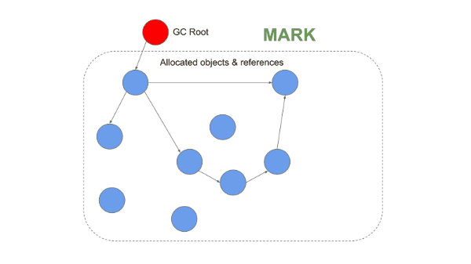
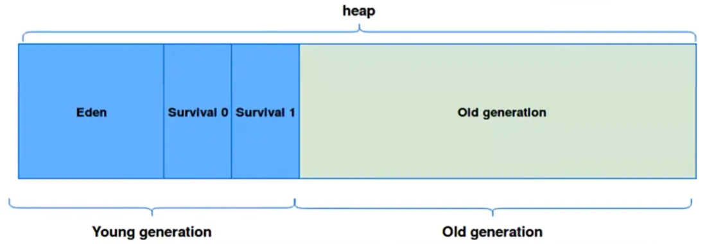
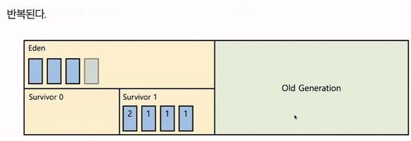
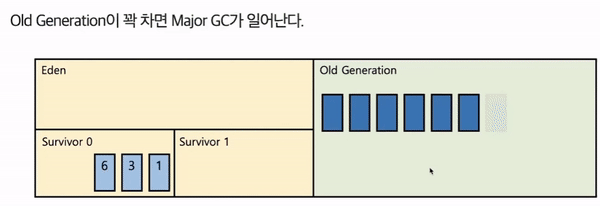

# Garbage Collection

## 1. 정의

가비지 컬렉션은 JVM의 Heap 영역에서 더 이상 사용되지 않는 객체를 자동으로 제거하여 메모리를 관리해주는 기능이다. 덕분에 Java에서는 메모리 할당 이후 수동으로 해제할 필요가 없으며, 개발자가 메모리 관리 문제에서 자유로워지고 개발에만 집중할 수 있다. Java뿐만 아니라 파이썬, 자바스크립트, Go 언어 등 다양한 언어에서 가비지 컬렉션을 지원한다.

## 2. 객체 상태

가비지 컬렉션은 객체를 다음과 같은 2가지 상태로 구분한다. 

1. **Reachable**
    
    객체가 참조되고 있는 상태를 의미한다. Heap 영역에 동적으로 생성된 객체가 Method Area나 Stack Area의 변수로부터 참조되면 Reachable 상태가 된다.
    
2. **Unreachable**
    
    객체가 참조되고 있지 않은 상태를 의미한다. 객체를 참조하고 있던 변수가 삭제되거나 다른 주소를 참조하게 되면 해당 객체는 Unreachable 상태가 된다. 이러한 객체들은 가비지 컬렉션의 정리 대상이 된다.
    

## 3. 동작 방식

### 3-1. 기본적인 청소 방식



가비지 컬렉션은 3단계에 걸쳐 Unreachable한 객체를 제거한다.

1. **Mark**
    
    Method Area의 static 변수, Stack 영역의 지역 변수 등에서 시작하여 객체 참조를 따라가면서 도달할 수 있는 모든 객체를 마킹한다.
    
2. **Sweep**
    
    마킹되지 않은 객체를 Heap에서 제거한다.
    
3. **Compact**
    
    제거 후 Heap 영역 여기저기에 분산되어 있는 객체들을 앞에서부터 채워넣는다. GC 종류에 따라 생략하기도 한다.
    

### 3-2. Heap 영역 구분



Heap 메모리는 크게 Young 영역과 Old 영역으로 나눌 수 있다.

1. **Young**
    
    새롭게 할당된 객체가 존재하는 영역이다. 비교적 작은 공간이라 GC가 자주 발생하며 빠른 탐색이 가능하다. 대부분의 객체는 짧은 시간 동안 사용되기 때문에 Young 영역에 있다가 제거된다. Young 영역에서 발생하는 GC를 Minor GC라고 한다.
    
    Young은 Eden, Survivor 0, Survivor 1로 세분화된다.
    
    1. **Eden**
        
        new를 통해 새로 할당된 객체가 존재하는 영역이다.
        
    2. **Survivor 0 / Survivor 1**
        
        Eden 영역에서 GC가 실행된 후 살아남은 객체가 존재하는 영역이다. 반드시 0이나 1 둘 중 하나만 사용되어야 한다.
        
2. **Old**
    
    Young 영역에서 오랜 시간동안 살아남은 객체가 존재하는 영역이다. 크기가 큰 일부 객체는 바로 Old 영역에 할당되기도 한다. 비교적 큰 공간이라 GC가 자주 발생하지 않으며 탐색에 오랜 시간이 걸린다. Old 영역에서 일어나는 GC를 Major GC 혹은 Full GC라고 한다.
    

### 3-3. Minor GC



1. 처음 생성된 객체는 Eden 영역에 할당된다.
2. 객체가 계속 생성되어 Eden 영역이 꽉 차면 Minor GC가 발생한다.
3. Mark 과정을 통해 Reachable한 객체를 식별한다.
4. Reachable한 객체를 Survivor 영역으로 이동시킨다.
5. Eden에 남아있는, 즉 Unreachable한 객체의 메모리를 해제한다.
6. 살아남은 모든 객체들의 age 값을 1만큼 증가시킨다.
7. 이후 다시 Eden 영역이 꽉 차면 2~6번 과정을 반복한다. 이때 Survivor 0과 Survivor 1은 번갈아가면서 사용된다.

### 3-4. Major GC



1. Minor GC의 6번 과정을 통해 age 값이 임계값에 다다르면 해당 객체는 Old 영역으로 이동한다. 일반적인 HotSpot JVM의 경우 기본 임계값은 31이다.
2. Old 영역이 꽉 차면 Major GC가 발생한다.
3. Mark-Sweep-Compact 과정을 통해 객체를 정리한다.

## 4. 알고리즘

일반적으로 Minor GC는 0.5초에서 1초 정도로 빠르게 실행되는 반면 Major GC는 10배 이상의 시간이 소요된다. GC가 실행되는 동안 JVM은 모든 애플리케이션 스레드를 중단하며 이를 Stop-The-World라고 한다. 따라서 가비지 컬렉션이 너무 자주 발생하면 성능 저하로 이어진다. 또한 자바가 발전하면서 Heap의 크기도 커짐에 따라 GC 수행 시간도 증가했다. 이를 해결하기 위해 다양한 가비지 컬렉션 알고리즘이 개발되었다.

1. **Serial GC**
    
    CPU 코어가 1개일 때 사용된다. GC를 단일 스레드로 처리하기 때문에 Stop-The-World 시간이 가장 길다. Minor GC에는 Mark-Sweep을 사용하고, Major GC에는 Mark-Sweep-Compact를 사용한다.
    
    ```bash
    java -XX:+UseSerialGC -jar Application.java
    ```
    
2. **Parallel GC**
    
    Java 8의 기본 GC이다. Minor GC는 멀티 스레드로, Major GC는 싱글 스레드로 처리한다.
    
    ```bash
    java -XX:+UseParallelGC -jar Application.java 
    ```
    
3. **Parallel Old GC**
    
    Minor GC와 Major GC 모두 멀티 스레드로 처리한다.
    
    ```bash
    java -XX:+UseParallelOldGC -jar Application.java
    ```
    
4. **CMS GC**
    
    애플리케이션 스레드와 GC 스레드가 동시에 실행된다. GC 과정이 매우 복잡하고 CPU 리소스를 많이 사용한다. Java 9부터 deprecated 되었고 Java 14에서는 사용이 중지되었다.
    
    ```bash
    java -XX:+UseConcMarkSweepGC -jar Application.java
    ```
    
5. **G1 GC**
    
    Java 9부터 기본 GC이다. 4GB 이상의 Heap 메모리를 권장한다. Heap을 Region이라는 단위로 나눠서 Eden, Survivor, Old 등의 영역을 동적으로 설정한다. Region 별로 GC가 발생하며 메모리가 많이 차있는 Region을 우선적으로 GC 한다. Eden, Survivor 0, Survivor 1 순서를 따르지 않고 그때그때 효율적이라고 판단되는 영역에 객체를 재할당한다.
    
    ```bash
    java -XX:+UseG1GC -jar Application.java
    ```
    
6. **Shenandoah GC**
    
    Java 12부터 사용 가능하다. CMS가 가진 단편화, G1이 가진 pause의 문제를 해결했다. 강력한 Concurrency와 가벼운 GC 로직으로 Heap 사이즈에 영향을 받지 않고 일정한 pause 시간이 소요된다.
    
    ```bash
    java -XX:+UseShenandoahGC -jar Application.java
    ```
    
7. **ZGC**
    
    Java 15부터 사용 가능하다. G1의 Region처럼 ZPage라는 단위를 사용한다. ZPage는 Region과 다르게 크기가 고정되지 않고 2MB 배수 단위로 동적으로 운영된다. Heap 크기가 증가해도 Stop-The-World의 시간이 10ms를 넘지 않는다.
    
    ```bash
    java -XX:+UnlockExperimentalVMOptions -XX:+UseZGC -jar Application.java
    ```

---

참고 자료

- https://inpa.tistory.com/entry/JAVA-%E2%98%95-%EA%B0%80%EB%B9%84%EC%A7%80-%EC%BB%AC%EB%A0%89%EC%85%98GC-%EB%8F%99%EC%9E%91-%EC%9B%90%EB%A6%AC-%EC%95%8C%EA%B3%A0%EB%A6%AC%EC%A6%98-%F0%9F%92%AF-%EC%B4%9D%EC%A0%95%EB%A6%AC