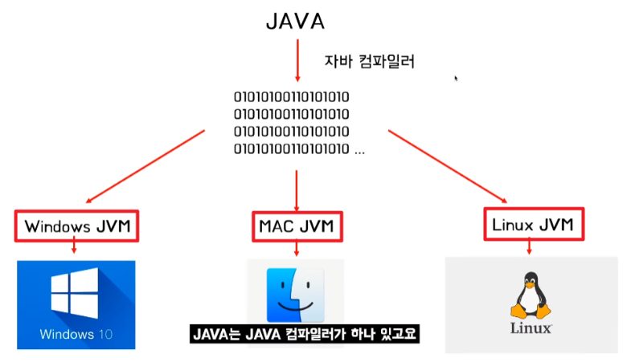
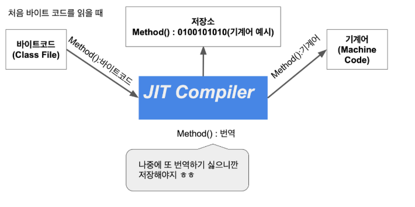
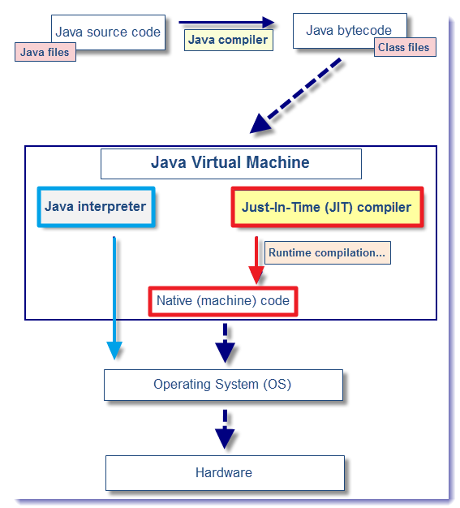
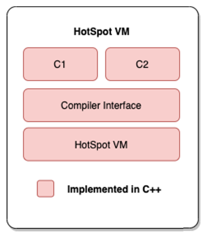
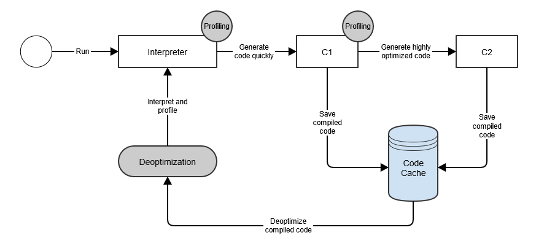
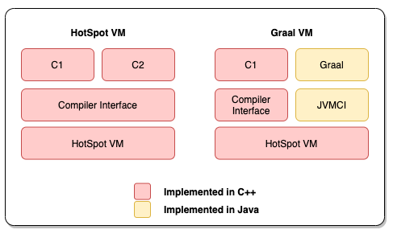

> ### JIT 컴파일러 

JAVA는 WORA(Write Once Run AnyWhere)라는 목표를 위해서 운영체제마다 의존적이지 않은 시스템을 만들기 위해 JVM을 만들었다.

JAVA 언어로 작성한 소스파일은 운영체제가 아닌 JVM을 거쳐서 운영체제와 상호하는 작용을 하게 된다. 
따라서 JVM만 있으면 운영체제에 관계 없이 실행할 수 있다는 특징이 있다. 

이는 컴파일된 코드와 하드웨어/OS 사이 중간에서 하드웨어/OS 환경에 맞게 JVM이 Byte Code로 변환해주기 때문이다.

JAVA에서 코드의 변환 과정은 다음과 같이 정리가 가능하다.

1. Java Compiler가 JAVA로 작성된 소스 코드 .java 파일을 .class 파일인 Byte Code로 컴파일한다.
   (단, 해당 코드는 직접 CPU에서 동작할 수 있는 코드가 아닌 JVM이 이해할 수 있는 코드이다.)
2. Byte Code를 기계어로 변환시키기 위해 가상 CPU인 JVM이 Byte Code를 기계어(Binary Code)로 변환한다.
3. CPU에서 운영체제에 맞는 Binary Code를 CPU에서 실행해 서비스를 제공한다.

위와 같은 특징은 이식성을 크게 높였지만,
자바 가상 머신에게 이해할 수 있는 Byte Code로 만들고 그걸 다시 운영체제에 맞는 Binary Code로 바꾸는 절차로 두 번의 변환이 필요하다.

JAVA는 두 번의 변환으로 인해 실행시간이 느리다는 특징이 있는데, JIT 컴파일러를 활용하면 필요한 부분만을 기계어로 바꿔주어
성능 향상을 가져오고자 했다.

기존의 자바는 인터프리터 방식으로 명령어를 하나씩 실행하게 끔 동작을 했다.
하지만 JIT 컴팡리러는 같은 코드를 매번 해석하지 않고 실행할 때 컴파일하며 해당 코드를 캐싱한다. 
이후에는 바뀐 부분만 Native Code 형식으로 컴파일하고 나머지는 캐싱된 코드를 사용한다. 

이를 동적 번역이라 불리며 이전보다 성능 개선을 할 수 있었다. 
그래서 JAVA는 interpreter로만 혹은 JIT 컴파일러로만 동작한다고 보기보다는 혼합되어서 사용이 된다고 보는 게 맞다.

### JAVA 버전 별 JIT 컴파일러의 변화

JIT 컴파일러는 기능은 JDK 1.3부터 HotSpot VM에 도입이 되었다. 
과거의 JAVA 7버전 전까지는 과거의 방식(Interpreter)와 JIT 컴파일러 방식이 혼합되어 사용이 되었다.

과거의 JVM에서는 모든 바이트 코드를 기계어로 올려 즉시 시작되는 속도는 빨랐다. 대신, 변경이나 동작 속도가 느렸다.
반면 JIT 컴파일러 같이 즉시 시작되는 속도는 느리지만 최적화가 많이 되면 warm-up이 되어 빨라지는 경우도 있다.

JAVA 6까지는 전자를 c1(클라이언트 컴파일러)로, 후자를 c2 컴파일러로 구분하고 둘 중 하나를 선택하게 했었다.
하지만 JAVA 7부터는 혼합해서 사용할 수 있는 방법이 생겼고, JVM은 실행되는 코드를 주의깊게 관찰하여 자주 실행되는 부분을 분석해 최적화를 결정한다.
또한 코드 실행 방식까지 분석해 어떤 최적화를 적용할 지 아키텍처에 맞게 결정을 한다.

좀 더 자세하게 설명해보면, Hotspot VM에서는 인터프러터를 사용해서 최적화 없이 코드를 실행한다.
Hotspot VM은 각 메소드의 호출부를 계속 주시하면서 호출 횟수를 기록하며 일정 임계값을 초과하면 C1 Compiler에 넣고
재컴파일하여 최적화한다. 이후에도 계속 호출횟수가 특정 임계값을 넘으면 C2 컴파일러를 사용하여 추가적인 최적화를 한다.

이 때 컴파일된 최적화된 코드는 코드 캐시라 불리는 특수 힙에 저장이 된다.
관련 클래스가 언로드 될 때까지 또는 최적화되지 않을 때까지 코드 캐시가 저장이 된다.

그래서 다양한 JIT 컴파일러의 특징을 활용해서 최적화하는 기법들이 여러가지가 있다.
이는 JIT 컴파일러 관련 심화 내용을 통해 어떻게 컴파일 과정에 변화를 주어 최적화 시키는 지를 보자.

### GraalVM

위의 JIT 컴파일러도 한계가 있었다. 성능적인 최적화를 하기 위해 만들어진 JIT 컴파일러지만 레거시 코드화와 
다양한 차력쇼로 인해 만들어진 복잡한 코드로 추가적인 최적화를 진행할 개발자를 구하기가 어려웠다. 

그래서 새로운 컴파일러를 만들어 Hotspot VM의 c2 컴파일러를 대체하자는 프로젝트가 생성되었고, GraalVM이 시작되었다.

GraalVM은 JIT 컴파일러 중 C++로 작성된 C2 컴파일러인 Graal 컴파일러를 Java 기반으로 새롭게 작성했다.
자바로 만든 자바 컴파일러인 것이다.

결과적으로 GraalVM의 목표는 더 빠르고 유지하기 쉬운 컴파일러를 목표로 나온 컴파일러이며 아래와 같은 기능이 추가되었음을 추가적으로 언급하고자 한다.

- AoT 컴파일러: 미리 컴파일된 네이티브 실행 파일(JAVA 외의 언어: JS, Python)도 실행이 가능하다.
- Truffle: Truffle을 사용하면 JVM 기반 다양한 언어 생성(Scala, Groovy, Kotlin) 할 수 있다.

### 참고자료

JIT 컴파일러 관련 기초 내용
https://inpa.tistory.com/entry/JAVA-%E2%98%95-JVM-%EB%82%B4%EB%B6%80-%EA%B5%AC%EC%A1%B0-%EB%A9%94%EB%AA%A8%EB%A6%AC-%EC%98%81%EC%97%AD-%EC%8B%AC%ED%99%94%ED%8E%B8
https://inpa.tistory.com/entry/JAVA-%E2%98%95-JDK-JRE-JVM-%EA%B0%9C%EB%85%90-%EA%B5%AC%EC%84%B1-%EC%9B%90%EB%A6%AC-%F0%9F%92%AF-%EC%99%84%EB%B2%BD-%EC%B4%9D%EC%A0%95%EB%A6%AC

JIT 컴파일러 관련 심화 내용
https://mangkyu.tistory.com/302
https://mangkyu.tistory.com/343
https://mangkyu.tistory.com/345