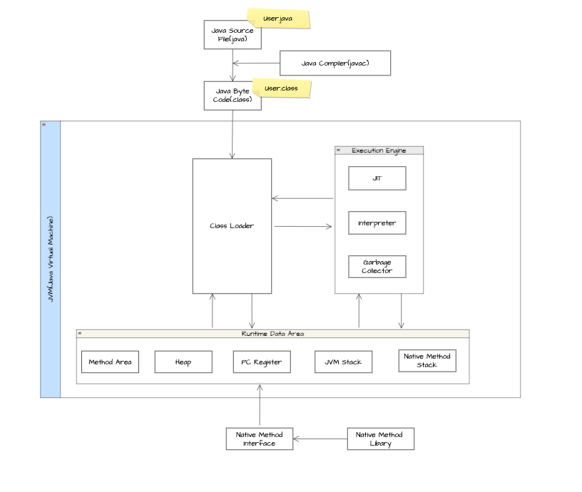
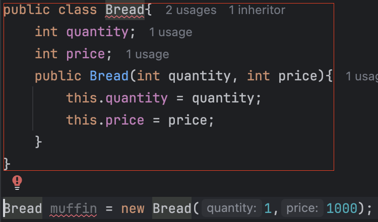
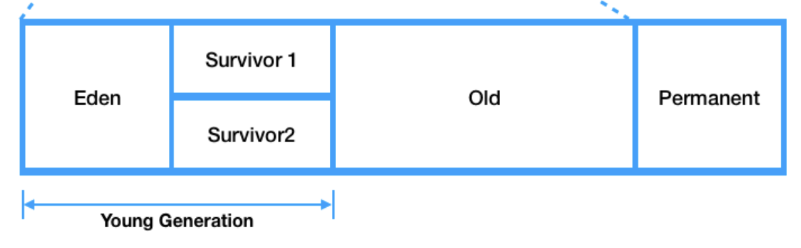
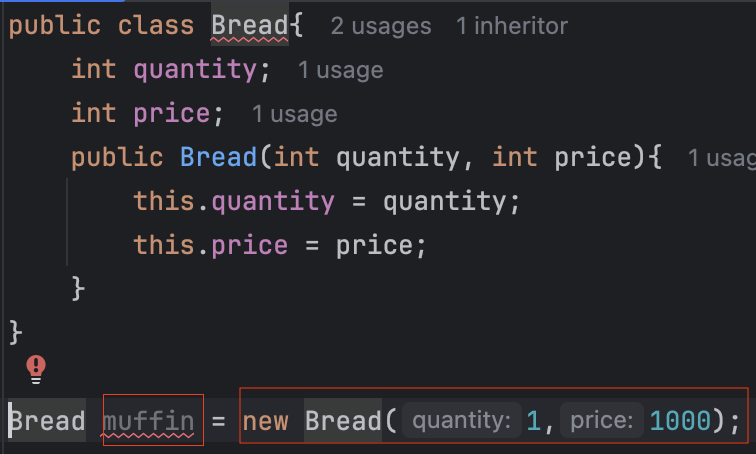
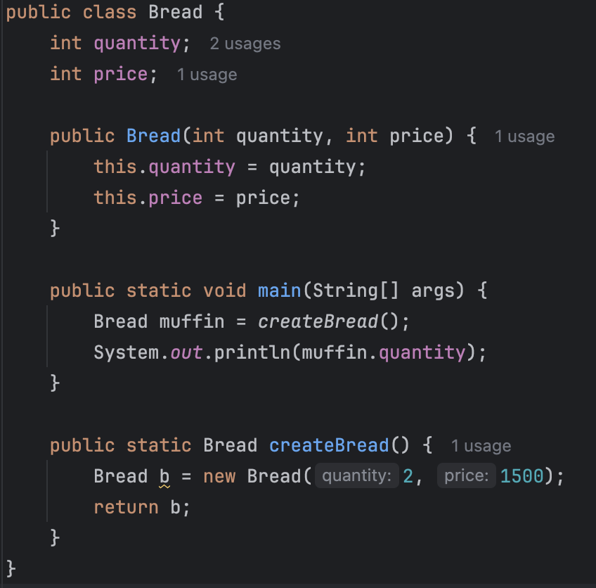

# JVM 내부 구조 & 메모리 영역
***
## JVM이란?
자바 프로그램을 실행시키기 위한 가상 머신으로 OS 종속적이던 기존의 언어들과는 달리 JVM은 자바 소스코드를 각각의 언어로 하나의 파일
형식(byte.code, 클래스 파일)을 가지고 컴파일 해주는 역할을 수행해주어 자바가 OS 독립적으로 실행이 가능하게 하는 가상 머신이다.
***
## JVM 동작과정

### 1. 사용자가 Java 소스코드를 작성한다. => User.java
### 2. 자바 컴파일러가 Java 소스코드를 Byte 코드로 컴파일한다. => User.class
* 이때 자바 컴파일러는 javac로 bin 폴더 내에서 확인할 수 있다.
### 3. JVM의 Class Loader가 Byte 코드를 Runtime Data Area로 동적 로딩 및 링크한다. => Heap 영역
* 동적 로딩: 다 올리는 것이 아닌 필요한 것들만 올린다는 뜻 => 파일을 실행할 때 로드
* Loading: 클래스 파일을 가져와서 JVM의 메모리에 올린다.
* Linking: 클래스 파일을 검증한다.
  * Verifying: JVM 구성에 맞는지 검사
  * Preparing: 필요 메모리 할당
  * Resolving: 심볼릭 레퍼런스 -> 다이렉트 레퍼런스
### 4. Execution Engine이 Byte 코드를 명령어 단위로 읽어서 실행한다.
* Interpreter: Byte 코드 명령어를 하나씩 읽어서 해석하고 바로 실행한다.
* JIT 컴파일러: Byte 코드 전체를 Native 코드로 컴파일하고 캐싱해 두었다가 네이티브 코드로 직접 실행한다.
### 5. GC가 Heap 메모리에서 더는 사용하지 않는 메모리를 자동으로 회수한다.
***
## Runtime Data Area 이하 RDA
RDA는 JVM의 메모리 영역이며 자바 애플리케이션을 실행할 때 사용되는 데이터들을 적재하는 영역이다.
* Method 영역: 정적 필드와 클래스 구조가 담기는 영역
  * static
  * static final => 이 친구는 메서드 영역의 상수 풀에 저장이 된다.
  * 클래스 정보
    * 
    * 생성자의 Byte 코드
* Heap 영역: JVM이 관리하는 프로그램 상에서 데이터를 저장하기 위해 런타임 시 동적으로 할당하여 사용하는 영역
  * 여기서 생성된 객체들은 다른 객체의 필드에서 참조되는 용이다. => 참조하는 주체가 없으면 GC의 대상
  
  
  * new 실행 시 클래스의 객체가 heap에 저장된다.
    * 이 객체 안에는 필드가 저장된다.
* Stack 영역: 기본 자료형을 생성할 때 저장하는 공간으로, 임시적으로 사용되는 변수들이나 정보들이 저장되는 영역
  * 스택 영역은 각 스레드마다 하나씩 존재하며, 스레드가 시작될 때 할당된다.
  
  1. main() 메서드 실행 시 main 스택 프레임 생성
  2. createBread()가 호출되면서 createBread 스택 프레임 생성
  3. createBread에서 new가 실행되면서 Heap에 Bread 객체 생성
  4. createBread 종료 시 createBread 스택 프레임 제거
     * 생성된 객체는 main에서 muffin으로 참조 => 객체 유지
  5. main()이 종료되면 main 스택 프레임이 제거되고, 참조 주체가 없으므로 객체도 GC의 대상이 된다.
* PC Register: 스레드가 시작될 때 생성되며, 현재 수행중인 JVM 명령어 주소를 저장하는 영역 
=> 현재 작업하는 내용을 CPU에게 연산으로 제공하며 PCR은 이를 위한 버퍼 공간
* Native Method Stack: Native 코드가 실행되는 영역
***
# Java Native Interface
자바가 다른 언어로 만들어진 애플리케이션과 상호 작용할 수 있는 인터페이스.
=> 번역기 근데 C/C++만 제대로 한다고 함.
***
# Native Method Library
C/C++로 작성된 라이브러리

[출처]
* https://adjh54.tistory.com/279
* https://inpa.tistory.com/entry/JAVA-%E2%98%95-JVM-%EB%82%B4%EB%B6%80-%EA%B5%AC%EC%A1%B0-%EB%A9%94%EB%AA%A8%EB%A6%AC-%EC%98%81%EC%97%AD-%EC%8B%AC%ED%99%94%ED%8E%B8
