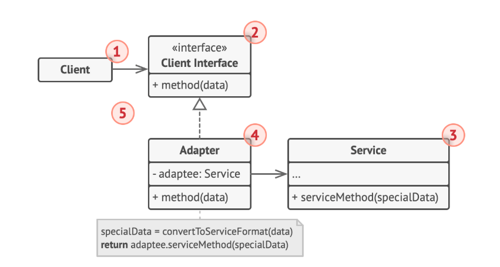

# adapter pattern

## 정의
어댑터 팬턴은 호환되지 않는 인터페이스를 가진 객체들이 협업할 수 있도록 하는 구조적 디자인패턴이다.

## 구조



### Adaptee
어댑터 대상 객체, 기존 시스템이나 외부 시스템

### Target (Client Interface)
Adapter가 구현하는 인터페이스

### Client
기존 시스템을 어댑터를 통해 이용한다. Target을 통해서 Adaptee를 사용할 수 있다.

### Adapter
Client - Adaptee를 중간에서 연결해준다.

## 코드
```java
// SearchServiceTolrAdapter : Adapter
// SearchService : Target
public class SearchServiceTolrAdapter implements SearchService {
    // Adaptee : 새로운 시스템
    private TolrClient tolrClient = new TolrClient();

    public SearchResult search(String keyword){
        TolrQuery tolrQuery = new TolrQuery(keyword);
        QueryResponse response = tolrClient.query(tolrQuery);
        SearchResult result = convertToResult(reponse);
        return result;
    }
}
```

기존 사용하던 SearchService의 인터페이스와 TolrClinet의 인터페이스가 다를 때 어댑터 패턴을 사용하면 OCP를 지키면서 확장할 수 있다.

### 장점
* 기존 코드를 수정하지 않고 새로운 기능으로 갈아낄 수 있다. (OCP)


## 참고자료
[https://inpa.tistory.com/entry/GOF-%F0%9F%92%A0-%EC%96%B4%EB%8C%91%ED%84%B0Adaptor-%ED%8C%A8%ED%84%B4-%EC%A0%9C%EB%8C%80%EB%A1%9C-%EB%B0%B0%EC%9B%8C%EB%B3%B4%EC%9E%90#%ED%8C%A8%ED%84%B4_%EC%9E%A5%EC%A0%90](https://inpa.tistory.com/entry/GOF-%F0%9F%92%A0-%EC%96%B4%EB%8C%91%ED%84%B0Adaptor-%ED%8C%A8%ED%84%B4-%EC%A0%9C%EB%8C%80%EB%A1%9C-%EB%B0%B0%EC%9B%8C%EB%B3%B4%EC%9E%90#%ED%8C%A8%ED%84%B4_%EC%9E%A5%EC%A0%90)
[https://incheol-jung.gitbook.io/docs/study/undefined/undefined-2/undefined-5](https://incheol-jung.gitbook.io/docs/study/undefined/undefined-2/undefined-5)
[https://refactoring.guru/ko/design-patterns/adapter](https://refactoring.guru/ko/design-patterns/adapter)