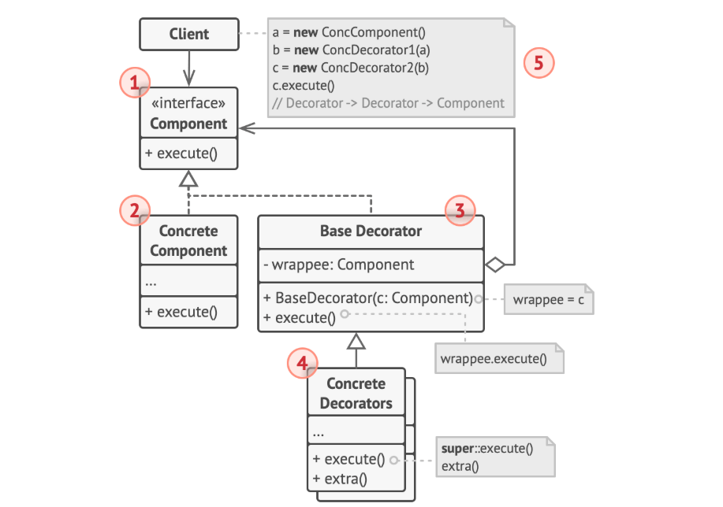

# decorator pattern

## 정의
데코레이터 패턴은 대상 클래스의 다른 인스턴스 동작에 영향을 주지 않으면서 개별 객체에 동작을 추가할 수 있게 해주는 디자인패턴이다.

## 구조



### Component
원본 객체와 장식할 객체들 모두를 묶는 공통 상위 인터페이스

### ConcreateComponent
원본 대상 객체

### Decorator
장식할 객체들을 추상화한 Decorator 클래스 <br>
원본 객체와 구현 메서드를 가지고 있다.

### ConcreateDecorator
Component 전후로 부가적인 로직을 추가하여 기능을 추가한다.

## 코드
```java
// Decorator
public abstract class Decorator implements Data {
    // ConcreateComponent
    private Data data; 
    
    public Decorator(Data data) {
        this.data = data;
    }
    
    protected void doSomething(byte[] data) {
        System.out.println(data);
    }
}

// ConcreateDecorator
public class EncryptData extends Data {
    public EncryptData(Data data) {
        super(data);
    }
    
    // decorator 로직을 wrapping
    public void doSomething(byte[] data) {
        byte[] encryptedData = encrypt(data);
        super.doSomething(encrytedData);
    }
    
    private byte[] encrypt(byte[] data) {
        //~~
    }
}

// 사용
public static void main(String[] args) {
    Data data = new DataImpl();
    Data encryptDecorator = new EncryptData(data);
    encryptDecorator.doSomething(data);
}
```

### 장점
* 객체를 여러 데코레이터로 감싸서 기능을 추가할 수 있다.
* 컴파일 타임이 아닌 런타임에 동적으로 기능을 변경 가능하다.
* 새로운 기능을 추가하고 싶을 때 기존 코드를 수정하지 않고 새로운 ConcreateDecorator를 작성함으로써 OCP를 지킬 수 있다.

### 단점
* 초기 데코레이터를 적용할 때 코드 가독성이 떨어진다
  * ex) new A(new B(new C ...));

### 주의점
데코레이터 순서에 따라서 동작이 달라진다.
ex)
```java
// A -> 
A a = new A(new B(new C()));
// A->B->C 순으로 적용
```

## 참고자료

[https://inpa.tistory.com/entry/GOF-%F0%9F%92%A0-%EB%8D%B0%EC%BD%94%EB%A0%88%EC%9D%B4%ED%84%B0Decorator-%ED%8C%A8%ED%84%B4-%EC%A0%9C%EB%8C%80%EB%A1%9C-%EB%B0%B0%EC%9B%8C%EB%B3%B4%EC%9E%90](https://inpa.tistory.com/entry/GOF-%F0%9F%92%A0-%EB%8D%B0%EC%BD%94%EB%A0%88%EC%9D%B4%ED%84%B0Decorator-%ED%8C%A8%ED%84%B4-%EC%A0%9C%EB%8C%80%EB%A1%9C-%EB%B0%B0%EC%9B%8C%EB%B3%B4%EC%9E%90)
[https://refactoring.guru/ko/design-patterns/decorator](https://refactoring.guru/ko/design-patterns/decorator)
[https://incheol-jung.gitbook.io/docs/study/undefined/undefined-2/undefined-3](https://incheol-jung.gitbook.io/docs/study/undefined/undefined-2/undefined-3)
