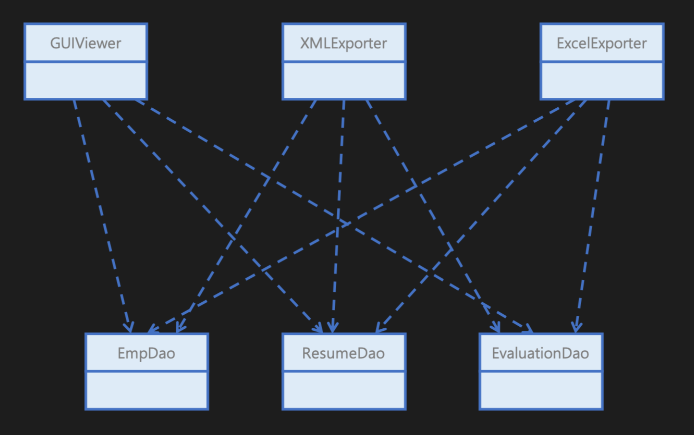
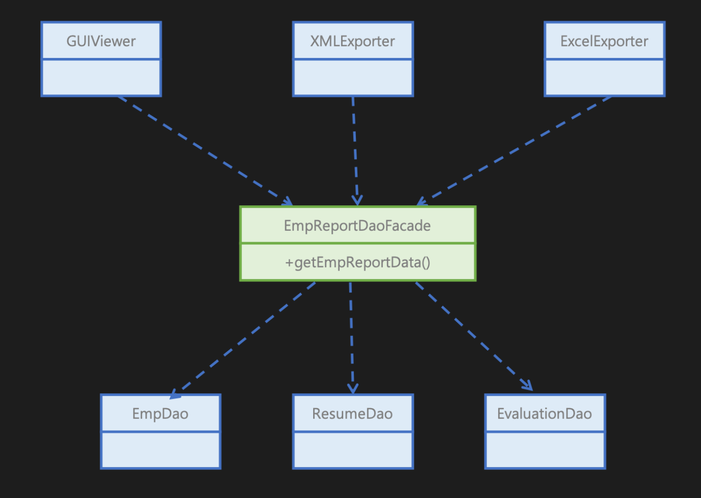

# Facade Pattern
- Facade 패턴은 복잡한 시스템을 단순화된 인터페이스로 제공하기 위해 사용되는 구조 패턴
- SubSystem의 기능을 편리하게 사용할 수 있도록, 여러 시스템과 상호 작용하는 복잡한 로직을 재정리해서 높은 수준의 인터페이스를 구성한다. (추상화)
- Facade 역할은 SubSystem이 가진 많은 역할이나 기능을 앞단에서 부를 수 있는 ‘단순한 창구’ 역할을 한다.


## 패턴 장점
- SubSystem 사이의 복잡성에서 코드를 분리하여, 외부에서 시스템을 사용하기 쉬워진다.
- SubSystem 간의 의존 관계가 많을 경우 이를 감소시키고 의존성을 한 곳으로 모을 수 있다.
   - 실제 SubSystem의 내부 로직이 변경 되어도 상관 없기 때문에 의존성 감소
- 클라이언트가 시스템 내부 코드를 모르더라도 Facade 객체의 동작만 이해한 채 사용 가능하다.


## 패턴 단점
- Facade 클래스에 결합된 SubSystem 이 너무 많다면, 볼륨이 너무 커지고 유지 보수가 힘들어진다.
- Facade 클래스 자체가 SubSystem 대한 의존성을 가지게 되어 의존성을 완전히 피할 수는 없다.
- 추상화 하고자하는 시스템이 얼마나 복잡한지, Facade 패턴을 도입했을 때 얻는 이점과 추가적인 유지보수 비용을 비교하고 결정해야 한다.


---
# 파사드 패턴 사용 예시
## 상황
- 직원 정보, 직원의 이력 정보, 그리고 직원에 대한 평가 정보를 읽어 와 화면에 보여주는 GUI 프로그램을 만들려고 한다.
- 이 때, HR팀으로부터 화면뿐만 아니라 XML이나 엑셀로 동일한 데이터를 추출해 달라는 요구 사항이 있다.


## 문제
- 추가 기능을 구현하면서 발생할 수 있는 문제점 중 하나는, GUIViewer, XMLExporter, ExcelExporter 사이에 코드 중복이 발생한다는 점
- 새 클래스는 중복 코드를 통해 EmpDao, ResumeDao, EvaluationDao 객체를 사용하고 데이터를 추출하게 된다.
- 이런 코드 중복에서 더 큰 문제는 코드가 완전 중복되는게 아니라 GUIViewer, XMLExporter, ExcelExporter 마다 약간씩 달라질 수 있다는 점
- 중복 로직에서 미세한 차이가 발생하면 이후 개발자가 변경해야 할 때 미세한 차이점을 누락할 가능성이 높아짐
- 따라서 이들 Dao 들의 인터페이스에 일부 변화가 발생하면 이 Dao를 직접적으로 사용하고 있는 나머지 GUIViewer, XMLExporter, ExcelExporter에 모두 영향을 미치게 된다.








## 해결방법
- 코드 중복과 직접적인 의존을 해결하는데에 파사드 패턴을 사용할 수 있다.
- SubSystem을 감춰 주는 상위 수준의 인터페이스를 제공하여 해당 문제를 해결한다.


```java
// 파사드 패턴 적용 전
public class GuiViewer {
    public void display() {
        Emp emp = empDao.select(id);
        Resume resume = resumeDao.select(id);
        Evaluation eval = evaluationDao.select(id);
        ...
    }
}

// 파사드 패턴 적용 후
public class GuiViewer {
    public void display() {
        EmpReport rep = empReportDaoFacade.select(id);
        ...
    }
}
```


## 사용 의의
- 파사드 패턴으로, 클라이언트와 SubSystem 간의 결합을 제거한다. (SubSystem의 직접적인 사용을 하지 않게 추상화하기 때문)
- 파사드를 통해 SubSystem의 상세한 구현을 캡슐화한다. (만약, 내부 로직이 변경되더라도 밖에 주는 영향이 적다.)
- 다수의 클라이언트에 공통된 기능은 파사드를 통해서 쉽게 사용할 수 있도록 하고, 보다 세밀한 제어가 필요한 경우에는 서브 시스템에 직접 접근하는 방식도 선택할 수 있다.


---


ref.
- [facade-pattern-1](https://incheol-jung.gitbook.io/docs/study/undefined/undefined-2/undefined-7)
- [facade-pattern-2](https://inpa.tistory.com/entry/GOF-%F0%9F%92%A0-%ED%8D%BC%EC%82%AC%EB%93%9CFacade-%ED%8C%A8%ED%84%B4-%EC%A0%9C%EB%8C%80%EB%A1%9C-%EB%B0%B0%EC%9B%8C%EB%B3%B4%EC%9E%90)