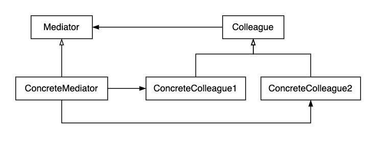

# Mediator Pattern
- Mediator Pattern(중재자 패턴)은 객체간의 상호작용을 캡슐화하는 디자인 패턴으로 프로그램의 실행중 행위를 바꾸는 방법으로 행위 패턴으로 분류 된다.
- 객체 지향 프로그래밍에서 여러 클래스간의 직접적인 상호작용이 많아지면 유지보수나 리팩토링이 어려워진다.
- Mediator Pattern 은 중재자 객체안에서 서로 다른 객체들을 캡슐화하여 객체들이 더 이상 직접적으로 상호작용하지않고 중재자를 통해서만 커뮤니케이션하도록 만든다.
- 즉, 객체간의 커뮤니케이션에서 의존성을 줄이며 클래스간 느슨한 결합을 만들어준다.





- Mediator: Colleague 객체간의 커뮤니케이션을 위한 인터페이스 정의
- Colleague: Mediator를 통해 다른 Colleague와 커뮤니케이션을 위한 인터페이스 정의
- ConcreteMediator: Mediator 구현체로 Colleague들 사이 상호 커뮤니케이션을 위해 Colleague들을 가지고 있으며 커뮤니케이션을 조정함
- ConcreteColleague: Colleague 인터페이스 구현체


## Mediator Pattern vs Observer Pattern
- Observer 패턴은 1개의 Publisher에 대해 N개의 Subscriber가 존재한다. 
- 즉, 복수의 Subscriber가 Publisher의 상태만 관찰하고 있다.
- 그러나 Mediator의 경우 M개의 Publisher와 N개의 Subscriber가 존재한다. 
- 즉, M개의 Publisher가 서로 상태를 관찰하기 때문에 Publisher가 Subscriber가 될 수도, Subscriber가 Publisher가 될 수도 있다.


## 간단한 사용 예시

```java
// 1. 채팅 서비스에 필요한 Mediator 인터페이스 정의
public interface Mediator {
    void addUser(Colleague user);
    void deleteUser(Colleague user);
    void sendMessage(String message, Colleague user);

}

// 2. Colleague 추상 클래스 정의를 통해 커뮤니케이션에 필요한 기능 정의
public abstract class Colleague {
    protected Mediator mediator;
    protected String name;

    public Colleague(Mediator mediator, String name) {
        this.mediator = mediator;
        this.name = name;
    }

    public abstract void send(String msg);

    public abstract void receive(String msg);
}

// 3. 구체적인 Mediator 정의
public class ConcreteMediator implements Mediator {
    private final List<Colleague> users;

    public ConcreteMediator() {
        this.users=new ArrayList<>();
    }

    @Override
    public void addUser(Colleague user) {
        this.users.add(user);
    }

    @Override
    public void deleteUser(Colleague user) {
        this.users.remove(user);
    }

    @Override
    public void sendMessage(String message, Colleague user) {
        for(Colleague u : this.users){
            if(u != user){
                u.receive(message);
            }
        }
    }
}

// 4. 구체적인 Colleague 정의
public class ConcreteColleague extends Colleague {
    public ConcreteColleague(Mediator mediator, String name) {
        super(mediator, name);
    }

    @Override
    public void send(String msg) {
        System.out.println(this.name+": Sending Message="+msg);
        mediator.sendMessage(msg, this);
    }

    @Override
    public void receive(String msg) {
        System.out.println(this.name+": Received Message:"+msg);
    }
}
```


---
ref.
- [mediator-pattern-1](https://brownbears.tistory.com/568)
- [mediator-pattern-2](https://ganghee-lee.tistory.com/8)