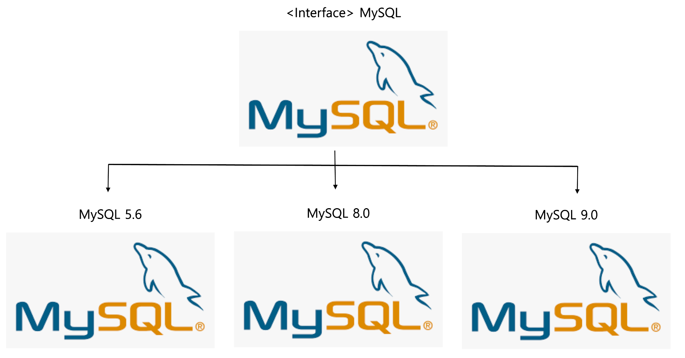
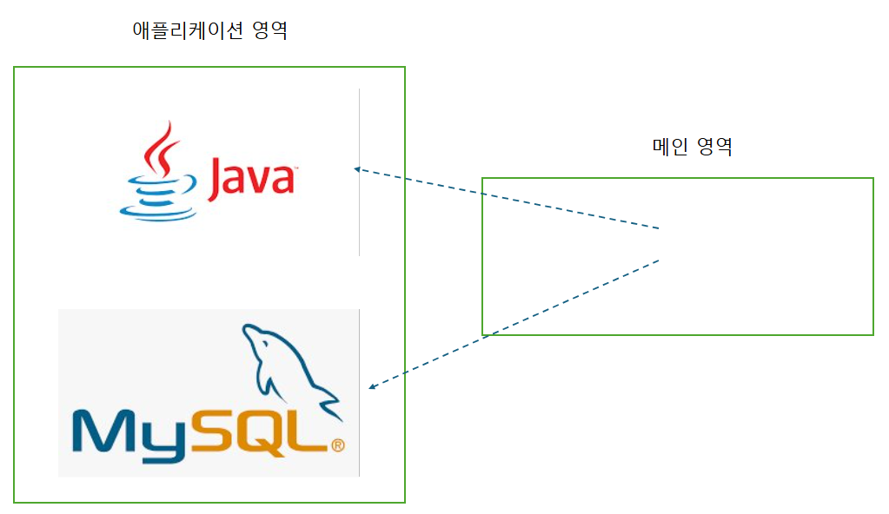

> ### DI란 무엇인가?

DI는 Dependency Injection의 약자로, 외부로 객체의 생성과 조립의 책임을 넘겨서 조금 더 확장성을 가지기 위한 방법이다.

예를 들어 아래와 같은 코드가 있다고 해보자. Spring이라는 클래스가 있고 거기에는 Java랑 MySQL이라는 객체가 들어간다고 해보자.
그러면 우리는 순수한 자바 코드로 만든다면 일반적으로 코드를 다음과 같이 작성하게 될 것이다.

```java
public class Spring {
    private final Java java = new Java(...);
    private final MySQL mysql = new MySQL5.6(...); 
    
    ...
}
```

다음과 같이 코드를 작성하게 되면 생기는 문제점이 있다. 만약에 MySQL에 버전이 여러 개 있다고 해보자.



위의 코드 구조에서는 만약 MySQL 5.6으로 구현체가 들어가 있는 상태에서 
MySQL8.0, MySQL9.0으로 넘어가는 것에 대해 직접 소스 코드를 바꾸지 않는다면 불가능하다.

하지만 확장성을 위해서는 원본 소스 코드를 변경하지 않고도 내부 구현에 대해서 변경될 수 있는 게 좋다.

만약에 위의 코드를 다음과 같이 바꿨다고 해보자.

```java
public class Spring {
    private final Java java;
    private final MySQL mysql; 
    
    public Spring(Java java, MySQL mysql) {
        this.java = java;
        this.mysql = mysql;
    }
    ...
}
```

그러면 이제 해당 Spring 코드를 실행하는 Main에서는 다음과 같이 코드를 작성할 수 있다.

```java
public class Main {
    
    public static void main(String[] args) {
        Java java = new Java17(...);
        MySQL mysql = new MySQL8.0(...);
        
        Spring spring = new Spring(java, mysql);
        ...
    }
}
```

이제 Main의 책임과 역할은 다음과 같이 정리를 할 수 있다.

- 어플리케이션 영역에서 사용될 객체를 생성한다.
- 각 객체 간의 의존 관계를 설정한다.
- 어플리케이션을 실행한다.




이제 구체 구현체를 정해주는 책임은 Spring 클래스가 아니라 Main 클래스가 가지게 된다.
기존의 코드에 존재하던 구체 구현체를 정하는 역할을 분리하여 개방-폐쇄 원칙을 지킬 수 있게 된 것이다. 

메인이 가지는 작업은 다음과 같이 이제 정의가 된다. 이제 Main이 아니라 제 3의 무언가가 이걸 대체할 것이고 Spring 같은 경우에는
이 역할을 스프링 컨테이너가 한다. 보통 이런 컨테이너 역할을 프레임워크에서 지원해주지 않는다면 서비스 로케이터 등을 직접 구현해서
이런 객체 생성에 대한 책임을 지정해주어야 한다.

이외에도 이런 DI가 있을 때의 장점은 테스트 코드를 작성할 때에도 도움이 된다.
만약에 테스트 코드를 작성할 때 아직 내부적인 구현체가 완성되지 못한 경우, 아니면 외부 시스템과 연관이 있어서 직접 실제처럼 테스트를
하지 못하는 경우에는 내부 구현체를 Mocking해서 돌릴 필요가 있을 때가 있다.

이 때, DI가 지원되지 않는다면, 직접 소스 코드를 수정을 할 때에 내부 코드를 Mock 객체로 변경을 해놓고, 다시 테스트가 끝나면 원래 객체로
바꾸어야 하는 불편함이 존재한다. 프로젝트의 규모가 커질수록, 서로 간의 컨텍스트 공유가 적을 수록 개발자가 임의로 이런 변경해야 하는 사항이 
많아지면 실수할 가능성이 굉장히 높아진다. **대부분의 버그는 변수 순서를 잘못 쓰거나, 나중에 변경해야지하고 변경하지 못한 경우가 많았다.**

DI는 test profile에서만 기존 객체를 Mock 객체로 바꿔주어 이런 실수를 할 가능성을 줄여주는 역할도 한다.

---

> ### DI를 사용하는 두 가지 방법

#### 1. 생성자 활용 방법

생성자를 통해 전달 받은 객체를 필드에 보관한 뒤 활용을 하는 방법이다. 아래의 코드를 보면 생성자를 통해 전달받은 객체로 내부의
코드를 실행하고 있는 모습을 볼 수 있다. 

```java
public class Spring {
    private final Java java;
    private final MySQL mysql;

    public Spring(Java java, MySQL mysql) {
        this.java = java;
        this.mysql = mysql;
    }
    
    public void RunCode() {
        java.run();
        mysql.run();
    }
    ...
}
```

이 방법의 장점은 **객체를 생성하는 시점**에 필요한 모든 의존 객체를 준비할 수 있다. 생성자 방식은 생성자를 통해서 필요한 의존 객체를 전달받기
때문에 객체를 생성하는 시점에서 의존 객체가 정상인지 확인할 수 있다.

보통은 스프링에서는 순환 참조된 것들, 없어서 null로 되어있는 것들을 찾아서 코드를 실행하기전 컴파일 시점에
 예외를 발생시키고 없는 빈들에 대해서 찾을 수 없다라고 메시지를 내보낸다는 장점이 있다. 
또한, 객체가 생성이 되었다는 건 객체가 정상적으로 동작을 할 수 있음을 보장해주는 역할도 한다.

따라서 대부분의 사람들은 생성자 주입 방식을 권장하고, 스프링에서도 테스트 코드를 제외한 곳에서도 이 방식을 권장한다.

#### 2. 설정 메서드 방식

설정 메서드를 통해 객체에 대해서 설정으로 의존 객체를 받는 방식이다. 이전의 생성자 방식을 설정 메서드 방식으로 바꾸면 다음과 같다.

```java
public class Spring {
    private final Java java;
    private final MySQL mysql;

    public Spring() {
    }
    
    public void setJava(Java java) {
        this.java = java;
    }
    
    public void setMySQL(MySQL mysql) {
        this.mysql = mysql;
    }
    
    public void RunCode() {
        java.run();
        mysql.run();
    }
    ...
}
```

이 방법은 객체를 생성한 이후에 의존 객체를 설정할 수 있기 때문에 객체의 메서드를 실행하는 과정에서 NullPointException이 발생할 가능성을 높인다.
이러한 단점이 있지만 설정 메서드를 쓸 때 장점은 다음과 같다.

- 어떤 이유로 인해 의존할 객체가 나중에 생성이 된다면 설정 메서드 방식을 사용하는 게 좋다.
- 의존할 객체가 많은 경우, 설정 메서드 방식은 어떤 의존 객체가 설정되는 지 보다 쉽게 알 수 있어 가독성을 높여준다.

하지만, 전자로 작성해본 경험이 없어서 전자는 모르겠지만, 후자의 경우에는 Configuration 설정을 지원하는 프레임워크라면 그걸 사용하는 게 좋다.

> ### ※ 참고자료

개발자가 반드시 정복해야 할 객체 지향과 디자인 패턴, 최범균 저
