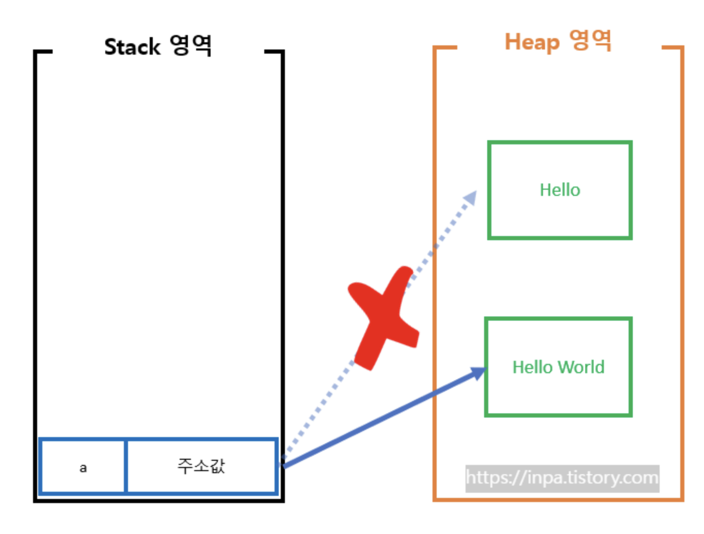
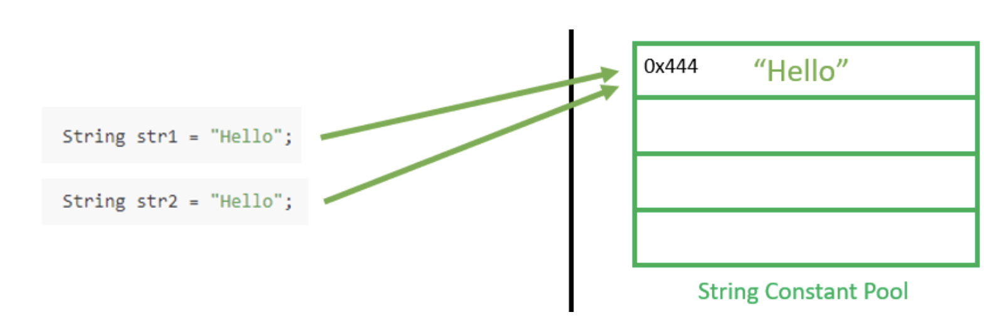

# 캡슐화
***
## 캡슐화란?
객체 지향의 장점은 한 곳의 변경이 다른 곳에 영향을 미치는 영향이 적다는 점이다.<br>
=> 캡슐화 : 객체가 내부적으로 어떻게 구현하는지를 감추어 영향이 전파되는 것을 최소화하는 것.

### 예시 코드
다음과 같이 회원 객체가 있다고 하자.
```java
class Member {
    private int name; // => private 접근 제어자를 통해 데이터 은닉
    private int age;
    private Date birthDate;

    // 사용자 만료 확인 메소드
    public boolean isBirthDay(){
        return birthDate.getDate() == System.currentTimeMillis();
    }
}
```

아래의 예시에서는 회원이 생일이면 선물을 주는 로직을 구현했다.<br>
main 클래스에서는 생일여부에 따른 boolean 값만 돌아온다는 것을 알고 내부 로직은 모르는 상태이다.<br>
=> 모르기 때문에 isBirthDay 로직이 바뀌어도 코드를 바꿀 필요가 없다.
```java
class main{
    if (member.isBirthDay()){
        givepresent();
    }
}
```
### => 캡슐화를 잘하면 구현 변경이 쉽다.
<br>

***

## 캡슐화 예제 in Java
String 클래스는 public으로 선언되어 있어 어디서든 사용이 가능하지만, final 선언으로 인해 상속받지는 못한다.<br>
=> String은 불변이기 때문에 캡슐화를 통해 이를 막은 것.
```java
public final class String
    implements java.io.Serializable, Comparable<String>, CharSequence,
               Constable, ConstantDesc {

    @Stable
    private final byte[] value;

    private final byte coder;

    private int hash;

    @IntrinsicCandidate
    public String(String original) {
        this.value = original.value;
        this.coder = original.coder;
        this.hash = original.hash;
        this.hashIsZero = original.hashIsZero;
    }

    public String(char[] value) {
        this(value, 0, value.length, null);
    }

    public String(char[] value, int offset, int count) {
        this(value, offset, count, rangeCheck(value, offset, count));
    }

    private static Void rangeCheck(char[] value, int offset, int count) {
        checkBoundsOffCount(offset, count, value.length);
        return null;
    }
}
```
# +
### 근데 왜 String은 불변일까?
실제 자바에서는 String s = "Hello"에 "World"를 붙이면 문자열 자체를 수정하는 것이 아닌 새 문자열을 만들고 참조를 바꾼다.


1. JVM에서 따로 String Constant Pool이라는 영역을 만들고, 문자열을 상수화하여, 공유 과정에서 캐싱이 되어, 성능적 이득을 취하기 위함.
2. 멀티스레드 환경에서 동기화 문제 방지.
3. 보안. => 참조 값을 바꾸지 못하게 하기 위해.

~~~java
String s = new String; //=> 이런게 없는 이유다.
/**
 * 아래의 두 변수는 사실 같은 주소를 가리킨다. => 재사용한다는 뜻.
 * .equals로 비교하는 이유도 사 그냥 고유 문자열만 비교하면 되기 때문.
 */
String str1 = "Hello";
String str2 = "Hello"; 
~~~

*intern()
해당 리터럴이 pool에 있는지 확인하고, 존재하면 pool에 있는 리터럴을 리턴하고, 아니면 새로 만들고 반환.

### String Constant Pool
- 해시테이블 구조
- Heap 생성
- GC의 대상이 됨.



### ※ 참고자료
* 개발자가 반드시 정복해야 할 객체 지향과 디자인 패턴, 최범균 저
* https://inpa.tistory.com/entry/JAVA-%E2%98%95-String-%ED%83%80%EC%9E%85-%ED%95%9C-%EB%88%88%EC%97%90-%EC%9D%B4%ED%95%B4%ED%95%98%EA%B8%B0-String-Pool-%EB%AC%B8%EC%9E%90%EC%97%B4-%EB%B9%84%EA%B5%90
* https://inpa.tistory.com/entry/OOP-%EC%BA%A1%EC%8A%90%ED%99%94Encapsulation-%EC%A0%95%EB%B3%B4-%EC%9D%80%EB%8B%89%EC%9D%98-%EC%99%84%EB%B2%BD-%EC%9D%B4%ED%95%B4#%EC%A0%95%EB%B3%B4_%EC%9D%80%EB%8B%89_oop%EC%9D%98_%ED%95%B5%EC%8B%AC