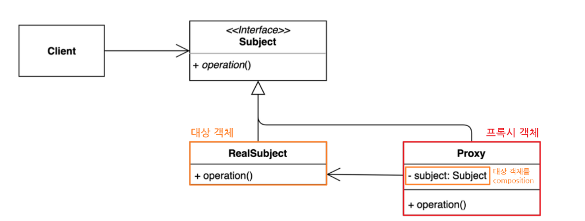

# proxy pattern

## 정의
프록시 패턴은 대상 원본 객체를 대리하여 대신 처리하게 함으로써 로직의 흐름을 제어하는 행동 패턴이다. <br>

## 구조



### Subject
Proxy 객체와 타겟 객체를 묶은 인터페이스 <br>
타겟 객체와 동일한 추상 메서드를 정의하고 Client 입장에서는 프록시가 호출되는지, 실제 객체가 호출되지는지 신경쓰지 않게 한다.

### Proxy
타겟 객체 앞에서 먼저 요청을 받는 중계자 역할을 수행 <br>

### Client
Subject 인터페이스를 통해 프록시 객체를 생성하고 이용 <br>
Client -> Proxy -> RealSubject

## 코드

```java

// Proxy
public class ProxyImage implements Image {
    private String path;
    // Target
    private RealImage image;

    public ProxyImage(String path) {
        this.path = path;
    }
    
    public void draw() {
        if (image == null){
            image = new RealImage(path); 
        }
        image.draw();
    }
}

public class ListUI {
    // 상위 타입인 Image를 통해 접근
    private List<Image> images;
    public ListUI(List<Image> images) {
        this.images = images;
    }

    public void onScroll(int start, int end) {
        for(int i = start; i <= end; i++) {
            // 호출하는 입장에서 Proxy 인지 실제 객체인지 알 수 없다.
            Image image = images.get(i);
            image.draw();
        }
    }
}
```

### 장점
* 기존 코드를 수정하지 않고 새로운 기능(로깅, 인증, 네트워크 통신)을 추가할 수 있다.
* Client는 프록시인지, 실제 객체인지 신경쓰지 않고 사용이 가능하다.

## 참고자료
[https://inpa.tistory.com/entry/GOF-%F0%9F%92%A0-%ED%94%84%EB%A1%9D%EC%8B%9CProxy-%ED%8C%A8%ED%84%B4-%EC%A0%9C%EB%8C%80%EB%A1%9C-%EB%B0%B0%EC%9B%8C%EB%B3%B4%EC%9E%90#%ED%8C%A8%ED%84%B4_%EC%9E%A5%EC%A0%90](https://inpa.tistory.com/entry/GOF-%F0%9F%92%A0-%ED%94%84%EB%A1%9D%EC%8B%9CProxy-%ED%8C%A8%ED%84%B4-%EC%A0%9C%EB%8C%80%EB%A1%9C-%EB%B0%B0%EC%9B%8C%EB%B3%B4%EC%9E%90#%ED%8C%A8%ED%84%B4_%EC%9E%A5%EC%A0%90)
[https://incheol-jung.gitbook.io/docs/study/undefined/undefined-2/undefined-4](https://incheol-jung.gitbook.io/docs/study/undefined/undefined-2/undefined-4)
[https://refactoring.guru/ko/design-patterns/proxy](https://refactoring.guru/ko/design-patterns/proxy)


