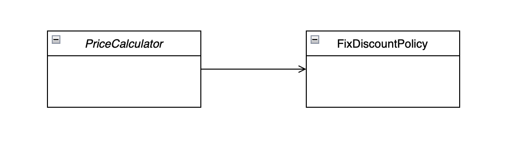
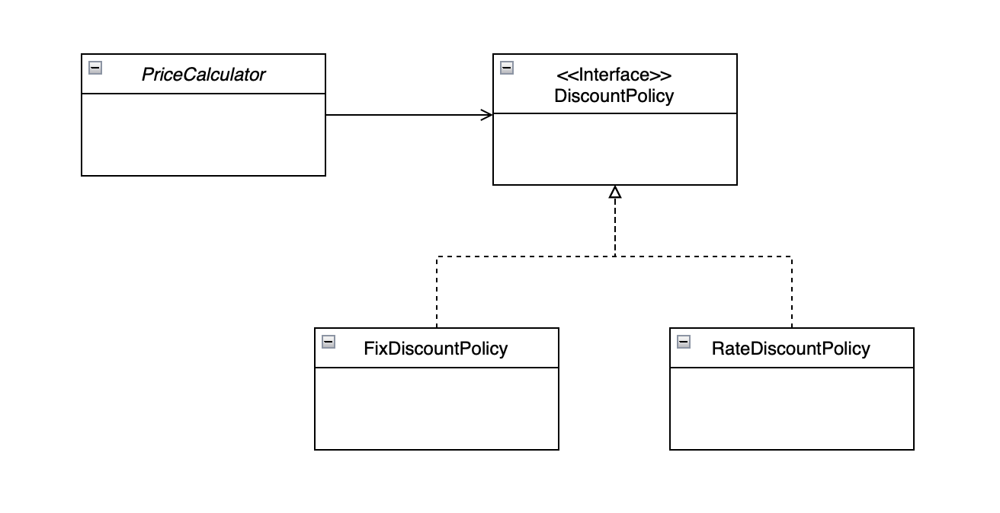

# SOLID

SOLID는 객체 지향적인 설계의 기본이 되는 다섯 가지 원칙을 의미한다. 이를 통해 프로그램의 유지보수성과 확장성을 높일 수 있다. 각 원칙들은 서로 밀접하게 연결되어 있기 때문에 하나의 원칙을 위반하면 다른 원칙도 위반하고 있을 가능성이 크다.

### 1. 단일 책임 원칙 (Single responsibility principle)

> **클래스는 단 하나의 책임만 가져야 한다.**
> 

책임은 변경을 기준으로 정의할 수 있다. 각각의 책임은 서로 다른 이유로 변경되고 서로 다른 비율로 변경된다. 따라서 변경 사항이 발생했을 때 코드 수정을 최소화하기 위해 클래스별로 책임을 분리해야 한다.

만약 한 클래스가 여러 개의 책임을 갖게 되면, 클래스 자체가 절차 지향적으로 설계될 여지가 있고 하나의 책임에 변경이 발생하면 클래스 전체가 영향을 받게 된다. 반면 각 책임을 클래스 단위로 분리하고 적절하게 추상화된 타입을 사용하면 특정 책임과 관련된 변경 사항이 발생했을 때 그 책임과 관련된 코드 부분만 수정하면 된다.

### 2. 개방 폐쇄 원칙 (Open-closed principle)

> **확장에는 열려 있어야 하고, 변경에는 닫혀 있어야 한다.**
> 

즉, 기능을 변경하거나 확장할 수 있으면서도 그 기능을 사용하는 코드는 수정하지 않도록 해야 한다. 이는 추후 변경 가능성이 있는 부분을 추상화해서 유연한 변경이 가능하도록 한다.

개방 폐쇄 원칙을 지키기 위한 대표적인 방법으로 추상화가 있다. 인터페이스나 추상 클래스를 사용해 확장 가능한 부분은 추상적으로 표현하는 것이다. 하지만 추상화를 통한 다형성만으로는 개방 폐쇄 원칙을 완벽하게 지키기 어렵기 때문에 의존관계 주입을 사용한다.

```java
// 할인 정책 인터페이스
public interface DiscountPolicy {
    double discount(int price);
}
```

```java
// 고정 금액 할인 정책
public class FixDiscountPolicy implements DiscountPolicy {
		private int discountFixAmount = 1000; // 1000원 할인
		
		@Override
		public int discount(int price) {
				return price - discountFixAmount;
		}
}
```

```java
// 할인 금액 계산기
public class PriceCalculator {
    private final DiscountPolicy discountPolicy;

    // 생성자를 통해 주입
    public PriceCalculator(DiscountPolicy discountPolicy) {
        this.discountPolicy = discountPolicy;
    }

    public int calculatePrice(int price) {
        return discountPolicy.discount(price);
    }
}
```

할인 정책에 대한 인터페이스를 만들고 고정 금액 할인 방식을 구현 클래스로 만들었다. 그리고 이를 사용하는 `PriceCalculator` 클래스에서는 인터페이스를 통해 할인 정책을 사용하고 있다. 이때 생성자를 통해 사용할 구현체를 주입받고 있다.

만약 특정 %만큼 할인을 적용하는 새로운 할인 정책이 필요하다면 다음과 같이 구현할 수 있다.

```java
// 비율 할인 정책
public class RateDiscountPolicy implements DiscountPolicy {
		private int discountPercent = 10; // 10% 할인
		
		@Override
		public int discount(int price) {
				return price * (1 - discountPercent / 100);
		}
}
```

우선 새로운 할인 정책 구현 클래스를 생성한다. 그리고 `PriceCalculator` 외부에서 `RateDiscountPolicy` 인스턴스를 주입하도록 변경하면 개방 폐쇄 원칙을 지키면서 확장이 가능하다.

이외에도 템플릿 패턴을 활용하면 개방 폐쇄 원칙을 지키면서 기능을 확장할 수 있다. 상위 클래스에서 로직의 구조를 정의하고, 변경이 필요한 부분만 하위 클래스에서 오버라이딩하도록 하면 된다. 이를 통해 기존 코드를 수정하지 않고도 새로운 기능을 추가할 수 있다.

### 3. 리스코프 치환 원칙 (Liskov substitution principle)

> **상위 타입의 객체를 하위 타입의 객체로 치환해도 상위 타입을 사용하는 프로그램은 정상적으로 동작해야 한다.**
> 

객체는 프로그램의 정확성을 깨뜨리지 않으면서 하위 타입의 인스턴스로 바꿀 수 있어야 한다. 이를 위해 다형성에서 하위 클래스는 상위 인터페이스의 규약이나 명세를 모두 지켜야 한다. 그렇지 않으면 인터페이스를 사용하는 쪽에서 구현체를 믿고 사용할 수 없다.

예를 들어 구매 시 중개 수수료를 붙이는 정책이 추가됐을 때 비슷하게 가격을 다루는 `DiscountPolicy` 인터페이스를 사용해서 이를 구현했다고 가정하자.

```java
// 할인 정책 인터페이스
public interface DiscountPolicy {
    double discount(int price);
}
```

```java
// 고정 금액 수수료 정책
public class FixChargePolicy implements DiscountPolicy {
		private int chargeFixAmount = 1000; // 1000원 수수료
		
		@Override
		public int discount(int price) {
				return price + chargeFixAmount;
		}
}
```

`DiscountPolicy`의 `discount` 메서드는 가격을 할인하는 역할을 수행하지만 `FixChargePolicy`는 오히려 가격이 추가되도록 구현되어 있다. 이처럼 하위 타입이 상위 타입이 기대하는 동작을 지키지 않으면 이를 사용하는 클라이언트 측에서 예상치 못한 오류가 발생할 수 있다. 따라서 `DiscountPolicy` 인터페이스의 `discount` 메서드는 반드시 가격을 낮추는 방향으로 구현해야 한다. 위와 같이 가격이 추가되도록 구현한다면 컴파일에 성공했다고 하더라도 리스코프 치환 원칙을 위반하는 것이다.

### 4. 인터페이스 분리 원칙 (Interface segregation principle)

> **인터페이스는 그 인터페이스를 사용하는 클라이언트 기준으로 분리해야 한다.**
> 

특정 클라이언트들을 위한 여러 개의 인터페이스가 범용적인 하나의 인터페이스보다 낫다. 또한 클라이언트는 자신이 사용하는 메서드에만 의존해야 한다. 이를 통해 클라이언트로부터 발생하는 변경의 여파가 다른 클라이언트에게 미치는 영향을 최소화할 수 있다.

아래는 인터페이스 분리 원칙을 위반한 예시이다.

```java
// 할인 정책 인터페이스
public interface DiscountPolicy {
    double discount(int price);
    double charge(int price);
}
```

```java
// 고정 금액 할인 정책
public class FixDiscountPolicy implements DiscountPolicy {
    private int discountFixAmount = 1000; // 1000원 할인

    @Override
    public double discount(int price) {
        return price - discountFixAmount;
    }

    @Override
    public double charge(int price) {
        throw new UnsupportedOperationException();
    }
}
```

```java
// 고정 금액 수수료 정책
public class FixChargePolicy implements DiscountPolicy {
    private int chargeFixAmount = 1000; // 1000원 수수료

    @Override
    public double discount(int price) {
        throw new UnsupportedOperationException();
    }

    @Override
    public double charge(int price) {
        return price + chargeFixAmount;
    }
}
```

`DiscountPolicy` 인터페이스가 할인과 수수료 두 개의 기능을 포함하면서 필요하지 않은 메서드까지 구현해야 하는 문제가 발생했다. `FixDiscountPolicy`는 할인만 필요하지만 `charge` 메서드를, `ChargePolicy`는 수수료만 필요하지만 `discount` 메서드를 강제로 구현해야 한다.

```java
// 수수료 정책 인터페이스
public interface ChargePolicy {
    double charge(int price);
}
```

```java
// 고정 금액 수수료 정책
public class FixChargePolicy implements ChargePolicy {
    private int chargeFixAmount = 1000; // 1000원 수수료

    @Override
    public double charge(int price) {
        return price + chargeFixAmount;
    }
}
```

위와 같이 `ChargePolicy`를 별도의 인터페이스로 분리해서 문제를 해결할 수 있다. 이렇게 각 클래스가 자신이 필요한 기능만 구현하도록 해야 클라이언트 또한 필요한 메서드에만 의존할 수 있다. 이를 통해 불필요한 메서드 구현을 방지하고 변경의 영향을 최소화할 수 있다.

### 5. 의존관계 역전 원칙 (Dependency inversion principle)

> **고수준 모듈은 저수준 모듈의 구현에 의존해서는 안 된다. 저수준 모듈이 고수준 모듈에서 정의한 추상 타입에 의존해야 한다.**
> 

이때 클라이언트는 고수준 모듈, 구현체는 저수준 모듈에 해당한다. 클라이언트는 구현 클래스에 의존하지 말고 인터페이스나 추상 클래스에 의존해야 한다. 그래야 다양한 구현체를 쉽게 변경할 수 있고 프로그램의 유지보수성을 높일 수 있다. 만약 클라이언트가 구현체에 직접적으로 의존하게 되면 구현체 변경이 어려워진다.



위와 같은 경우는 클라이언트가 구현 클래스에 직접적으로 의존하고 있는 상황이다. 이렇게 되면 할인 정책을 바꿀 때마다 `PriceCalculator`에 직접적인 코드 변경이 발생한다.



인터페이스를 생성해 각 구현 클래스들이 이를 구체화하고, 클라이언트가 인터페이스를 의존하도록 했다. 이로 인해 기존에 고수준 모듈이 저수준 모듈을 의존하고 있던 상황에서, 반대로 저수준 모듈이 고수준 모듈에서 필요로 하는 기능을 추상화한 인터페이스에 의존하게 됐다. 이를 의존관계 역전이라고 한다.

하지만 의존관계 역전은 소스 코드의 의존관계를 역전시킬 뿐 런타임에서의 의존관계까지 역전시키는 것은 아니다. 따라서 런타임 시에는 기존과 같은 형태의 의존관계가 발생하게 된다.