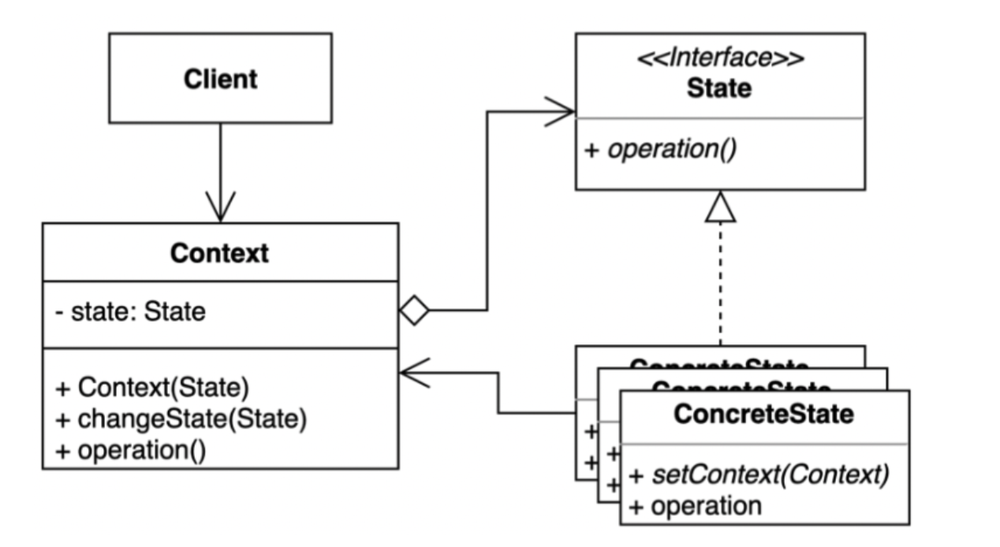

# state pattern

## 정의

상태 패턴은 객체의 내부 상태가 변경될 때 해당 객체가 그의 행동을 변경할 수 있도록 하는 행동 디자인 패턴이다.

## 구조



### Context

상태를 이용하는 주체로서 State 인터페이스에 대한 참조를 가지고 새로운 상태로 변경하기 위한 Setter를 가진다.

### State

상태를 추상화한 인터페이스를 말한다.

### ConcreateState

특정 상태를 구현한 구체 클래스이다. 다음 상태가 결정되면 Context에 상태 변경을 요청할 수 있다.


## 코드

```java
// Context
public class VendingMachine {
    private State state;

    public VendingMachine() {
        state = new NoCoinState();
    }
    
    public void insertCoin(int coin) {
        state.increateCoin(coin, this); 
    }
    
    public void select(int productid) {
        state.select(productid, this); 
    }
    
    public void changeState(State newState){
        this.state = newState;
    }
}

// State
public interface State {
	public void insertCoin(int coin, VendingMachine vm);
  public void select(int productId, VendingMachine vm);
}

// ConcreateState
public class NoCoinState implements State {
    @Override
    public void insertCoin(int coin, VendingMachine vm){
        vm.insertCoin(coin);
        vm.changeState(new SelecableState()); // <- 다음 상태로 이동 요청
    }
    
    @Override
    public void select(int productId, VendingMachine vm){
      	System.out.println("water")
    }
}

```


### 장점

* 상태에 따른 동작을 클래스에 관리할 수 있다. (원래 조건 분기 처리를 해야한다. 상태가 늘어나면 분기도 늘어나고 코드도 변경됨.)
* 상태와 관련된 모든 동작을 해당 상태 클래스에 작성(SRP)함으로써 코드 복잡도를 낮출 수 있다.
* 상태가 늘어나도 기존 코드를 변경하지 않아도 된다. (OCP)


### 단점

* 상태마다 클래스가 생긴다. (관리 포인트 증가)


## 참고자료

[https://refactoring.guru/ko/design-patterns/state](https://refactoring.guru/ko/design-patterns/state)

[https://incheol-jung.gitbook.io/docs/study/undefined/undefined-2/undefined-2](https://incheol-jung.gitbook.io/docs/study/undefined/undefined-2/undefined-2)

[https://inpa.tistory.com/entry/GOF-%F0%9F%92%A0-%EC%83%81%ED%83%9CState-%ED%8C%A8%ED%84%B4-%EC%A0%9C%EB%8C%80%EB%A1%9C-%EB%B0%B0%EC%9B%8C%EB%B3%B4%EC%9E%90](https://inpa.tistory.com/entry/GOF-%F0%9F%92%A0-%EC%83%81%ED%83%9CState-%ED%8C%A8%ED%84%B4-%EC%A0%9C%EB%8C%80%EB%A1%9C-%EB%B0%B0%EC%9B%8C%EB%B3%B4%EC%9E%90)

