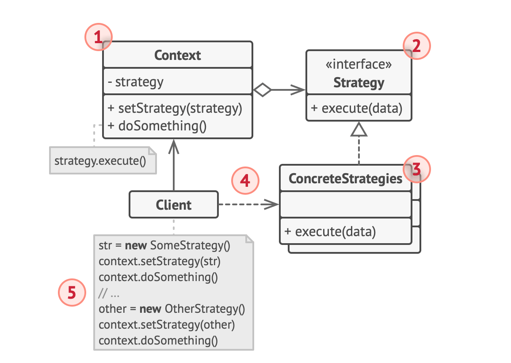

# Strategy-pattern

## 정의

전략 패턴은 란타임에 알고리즘 전략을 선택하여 객체 동작을 실시간으로 바뀌도록 할 수 있는 행위 디자인 패턴을 말한다. 

## 구조



### Context

전략 중 하나에 대한 참조를 유지하는 객체로 전략 인터페이스를 통해서 통신한다. strategy를 인터페이스로 들고 있다.

### Strategy

모든 전략 구현체에 대한 공용 인터페이스이다.

### ConcreateStrategies

실제 알고리즘 구현체이다. Context에서 set을 통해 다른 전략으로 갈아낄 수도 있다.

### Client

특정 전략 객체를 생성하여 Context에 전달한다. 전략 등록, 변경이 가능하고 전략 실행 결과를 받는 주체이다. <br>


5번이 Client 코드인데 전략을 생성하여 컨텍스트에 세팅한다. 그리고 Context의 `doSomething()`메서드를 호출하여 현재 세팅된 전략 알고리즘을 실행시킨다.


## 예제

상품에 대한 할인정책 1, 2가 존재하고 고객에 따라서 정책을 다르게 적용해야 하는 상황이다. 이럴 때 전략 패턴을 사용하면 확장에 용이한 설계가 가능해진다. 만약 전략 패턴을 적용하지 않고 구현하면 if/else로 구현하게 될텐데 추후 전략이 늘어나면 기존 코드를 수정해야 한다.

```java
// Context
public class Calculator {
  private DiscountPolicy discountPolicy;
  
  public Calculator(DiscountPolicy discountPolicy) {
    this.discountPolicy = discountPolicy;
  }
  
  public int calculate(List<Product> proucts) {
		return products.stream()
      .mapToInt(product -> discountPolicy.discount(product))
      .sum();
  }
}

// Strategy
public interface DiscountPolicy {
  int getDiscountPrice(Product product);
}

// ConcreateStrategy
public class DiscountPolicyOne implements DiscountPolicy {
  @Override
  public int getDiscountPrice(Product product) {
    return (int) (product.getPrice() * 0.9);
  }
}

// ConcreateStrategy
public class DiscountPolicyTwo implements DiscountPolicy {
    @Override
  public int getDiscountPrice(Product product) {
    return (int) (product.getPrice() * 0.5);
  }
}

// Client - Strategy 변경
public void SelectDiscountPolicyOne() {
  discountPolicy = new DiscountPolicyOne();
}

// Client - Strategy 변경
public void SelectDiscountPolicyTwo() {
  discountPolicy = new DiscountPolicyTwo();
}

// Client - Strategy 실행
public void clickCalculateButton() {
  Calculator calculator = new Calculator(discountPolicy);
  int price = calculator.calculate(product);
}

```


### 주의점

* 알고리즘마다 클래스를 작성해야 하기 때문에 전략이 많아진다면 관리 포인트가 늘어날 수 있다.


## Template callback Pattern

전략 패턴을 약간 변형한 패턴으로 맴버 변수로 Strategy를 가지고 있는것이 아니라 외부에서 파라미터로 실행시킬 알고리즘(callback)을 동적으로 주입하는 방식이다.


### 코드

```java
// functional interface
interface OperationStrategy {
    int calculate(int x, int y);
}

// Template
class OperationTemplate {
    int calculate(int x, int y, OperationStrategy cal) {
			return cal.calculate(x, y);
    }
}

// 사용
public static void main(String[] args) {
  OperationTemplate cxt = new OperationTemplate();
  int ret = cxt.calculate(10, 20, (x, y) -> x+y);
}

```

기존에는 Context(Template)에서 Strategy 인터페이스를 맴버 필드로 가지고 있고 이를 활용하여 알고리즘을 호출했다면 Template Callback Pattern에서는 callback을 파라미터로 받아서 실행한다.

-> 스프링의 Template이 붙은 클래스들은 Template callback Pattern으로 구현되어 있다.


## 참고자료

[https://refactoring.guru/ko/design-patterns/strategy](https://refactoring.guru/ko/design-patterns/strategy)

[https://incheol-jung.gitbook.io/docs/study/undefined/undefined-2/undefined](https://incheol-jung.gitbook.io/docs/study/undefined/undefined-2/undefined)

[https://inpa.tistory.com/entry/GOF-%F0%9F%92%A0-%EC%A0%84%EB%9E%B5Strategy-%ED%8C%A8%ED%84%B4-%EC%A0%9C%EB%8C%80%EB%A1%9C-%EB%B0%B0%EC%9B%8C%EB%B3%B4%EC%9E%90](https://inpa.tistory.com/entry/GOF-%F0%9F%92%A0-%EC%A0%84%EB%9E%B5Strategy-%ED%8C%A8%ED%84%B4-%EC%A0%9C%EB%8C%80%EB%A1%9C-%EB%B0%B0%EC%9B%8C%EB%B3%B4%EC%9E%90)

[https://inpa.tistory.com/entry/GOF-%F0%9F%92%A0-Template-Callback-%EB%B3%80%ED%98%95-%ED%8C%A8%ED%84%B4-%EC%95%8C%EC%95%84%EB%B3%B4%EA%B8%B0](https://inpa.tistory.com/entry/GOF-%F0%9F%92%A0-Template-Callback-%EB%B3%80%ED%98%95-%ED%8C%A8%ED%84%B4-%EC%95%8C%EC%95%84%EB%B3%B4%EA%B8%B0)

