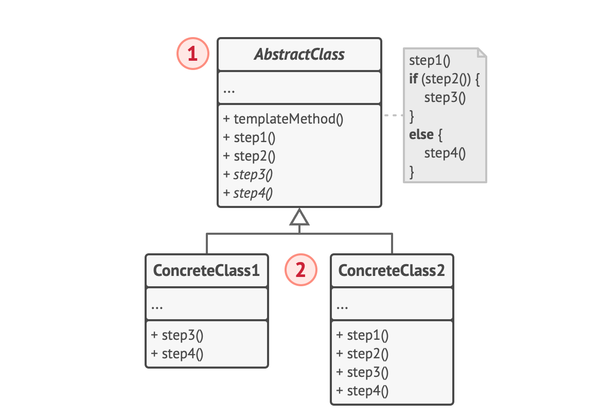

# Template Method Pattern

## 정의

템플릿 메서드 패턴은 부모 클래스에서 알고리즘의 골격을 정의하고 자식 클래스들이 알고리즘의 특정 단계들을 재정의할 수 있도록 구성한 행동 패턴이다.

## 구조



### AbstractClass

알고리즘의 단계들의 역할을 하는 메서드들을 선언해두고 이들을 특정 순서로 호출하는 템플릿이 작성되어 있다. 각 메서드는 abstract으로 선언되어 있거나 default 구현을 가진다.

### ConcreateClass

AbstractClass를 상속받아 추상 메서드를 구현한다. 구현한 메소드들은 AbstractClass에서 호출된다.


## 코드

```java
// AbstractClass
public abstract class Authenticator {
  	// algorithm 뼈대
    public AuthToken authenticate(String id, String pw) {
        if(!authenticate(id, pw)) throw createException(); // <- 하위 클래스에서 정의
        return createAuth(id); // <- 하위 클래스에서 정의
    }
    
    protected abstract boolean authenticate(String id, String pw);
    protected abstract AuthToken createAuth(String id);
}

// ConcreateClass
public class DbAuthenticator extends Authenticator {

    @Override
    protected boolean authenticate(String id, String pw) {
        return DbAuthenticator.authenticate(id, pw);
    }

    @Override
    protected AuthToken createAuth(String id) {
        DbContext ctx = DbClient.find(id);
        return new Auth(id, ctx.getAttributes("name"));
    }
}

// call
public static void main(String[] args) {
    Authenticator authenticator = new DbAuthenticator();
    AuthToken token = authenticator.authenticate("id", "password");
}
```


### 장점

* 공통 부분을 상위 추상 클래스에서 구현함으로써 코드의 중복을 줄일 수 있다.


### 단점

* 알고리즘 골격이 정해져 있어서 유연성이 떨어질 수 있다. (설계가 변경되었을 때 코드 수정 필요)
* 하위 클래스에서 구현할 때 해당 메소드가 어느 시점에 호출될 지 미리 로직을 이해하고 있어야 한다.


## 참고자료

[https://refactoring.guru/ko/design-patterns/template-method](https://refactoring.guru/ko/design-patterns/template-method)

[https://incheol-jung.gitbook.io/docs/study/undefined/undefined-2/undefined-1](https://incheol-jung.gitbook.io/docs/study/undefined/undefined-2/undefined-1)


