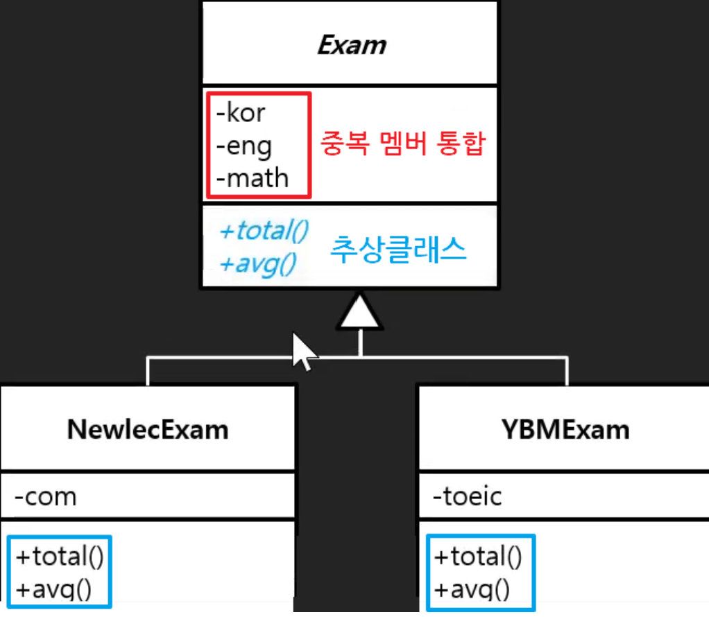
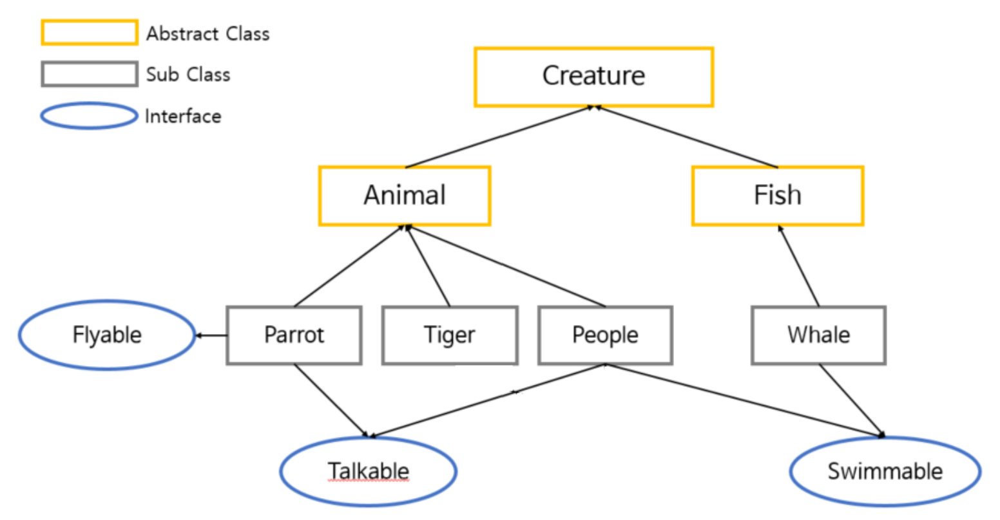

# 인터페이스 vs 추상클래스 사용 비교

- 인터페이스와 추상클래스는 모두 추상 메소드를 통해 상속/구현을 통한 메소드 강제 구현 규칙을 가지는 공통점이 있다.
- 이 둘이 가지는 고유의 특징, 내포하는 논리적 의미 등을 고려하여 사용 경우가 달라진다.

## 내포하는 논리적 의미
- Interface: `implements` 키워드 → 인터페이스에 정의된 메서드를 각 클래스 목적에 맞게 세부 구현체를 만든다. (규약을 정해놓고 세부 구현을 마음대로)
- Abstract Class: `extends` 키워드 → 자신의 기능들을 하위, 자식 클래스로 “확장” 시킨다. (기존에 부모가 가진 기능을 자식에서 확장한다)

## 추상 클래스를 사용하는 경우
### 중복 멤버 통합
- 중복되는 멤버를 상위 클래스로 묶어서 통합해줄 수 있다.
- 추상 클래스는 이런 클래스의 특징을 살려서, 중복되는 멤버들을 상속을 통해 활용할 수 있게 해준다.
- 해당 중복 멤버들을 계속 확장해서 사용하는게 필요할 때 사용할 수 있다.

### 추상 클래스의 다형성
- 인터페이스나 추상클래스 모두 다형성을 이용할수 있지만, 추상클래스를 통한 다형성에는 추가적인 의미가 있다.
- 부모 추상 클래스와 논리적으로 관련이 있는, 확장된 자식 클래스들을 다룬다.
    
    ⇒ 부모 클래스와 자식 클래스들이 의미적인 관계로 묶여 있다.
    
- 클래스 끼리 명확한 계층 구조가 필요할때도 추상클래스를 사용한다.
- 공통된 기능 구현과 공통으로 지켜야 할 규칙이 모두 있을 때, 상속을 통해 구조화 하여 재정의(overriding)을 통해 구현한다.

## 인터페이스를 사용하는 경우
- 추상 클래스를 사용하는 경우, 클래스끼리 논리적인 타입을 묶는 의미가 존재했다. 그러나 인터페이스의 구현은 논리적인 묶음이 없이 자유롭다.
    
    ⇒ 서로 논리적인 관련이 적은 클래스끼리 필요에 의해, 형제 타입 처럼 묶어서 구현할 수 있다.
    

- 상속에 얽매히지 않는 인터페이스에 추상 메소드를 선언하고, 이를 구현(implements) 하면서 자유로운 타입 묶음을 통해 추상화를 이룬다.

- 다중 상속이 필요할 때

- 마커 인터페이스로 사용할 때
  - 마커 인터페이스는 일반적인 인터페이스와 동일하지만, 내부에 아무 메소드도 선언하지 않은 빈 껍데기 인터페이스이다.
  - 인터페이스를 자유롭게 다중 상속이 가능하다는 점에서 착안하여 객체의 타입과 관련된 정보를 제공해주는 용도로 사용한다. (타입, 특징 체크용)

---

## 비교 정리
| 구분          | 추상 클래스 (Abstract Class) | 인터페이스 (Interface) |
|--------------|---------------------------|---------------------|
| **키워드**        | `extends`                  | `implements`        |
| **다중 상속 여부** | ❌ 불가능 (단일 상속만 가능) | ✅ 가능 (여러 개 구현 가능) |
| **필드 사용**     | ✅ 인스턴스 변수 가능 (`protected`, `private`) | ❌ 필드 사용 불가 (`static final`만 가능) |
| **접근 제어자**   | ✅ `public`, `protected`, `private` 모두 사용 가능 | ❌ `public`만 가능 |
| **사용 목적**     | 공통 기능 확장 (**is-a 관계**) | 공통 규약 정의 (**can-do 관계**) |

---
ref.
- [abstrac-class-and-interface](https://inpa.tistory.com/entry/JAVA-%E2%98%95-%EC%9D%B8%ED%84%B0%ED%8E%98%EC%9D%B4%EC%8A%A4-vs-%EC%B6%94%EC%83%81%ED%81%B4%EB%9E%98%EC%8A%A4-%EC%B0%A8%EC%9D%B4%EC%A0%90-%EC%99%84%EB%B2%BD-%EC%9D%B4%ED%95%B4%ED%95%98%EA%B8%B0)
