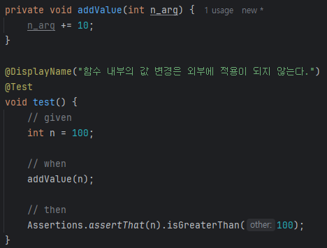
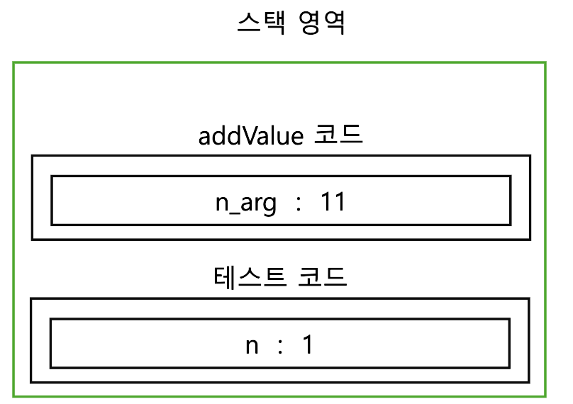
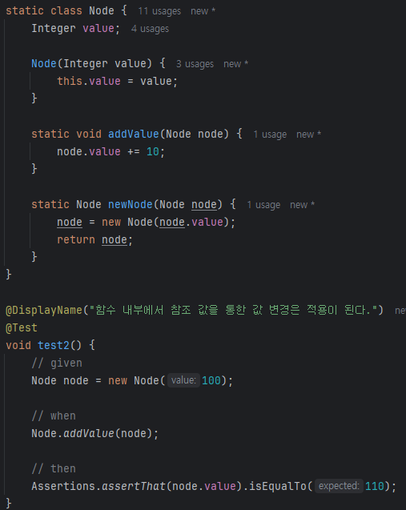
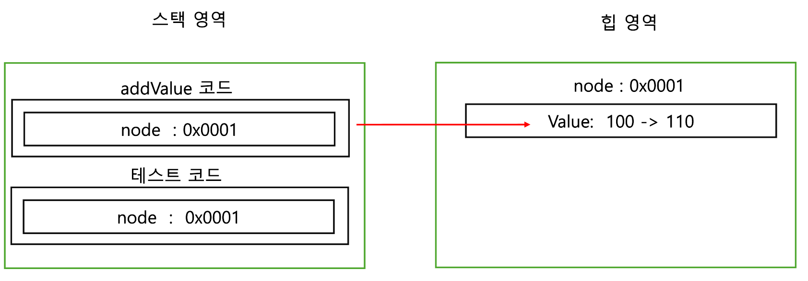
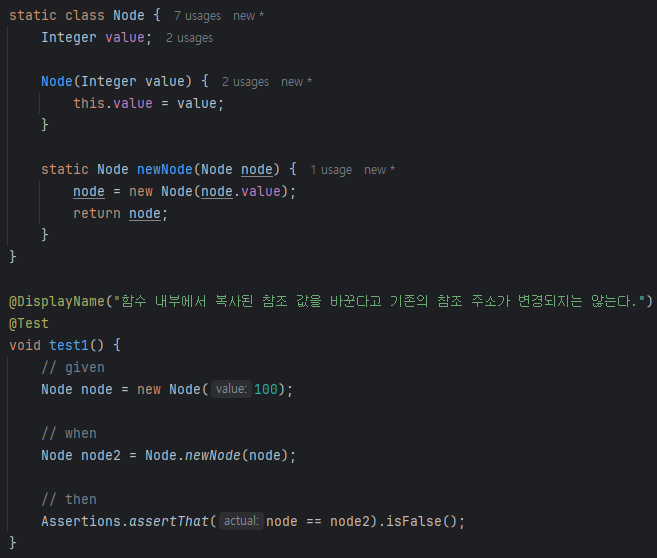
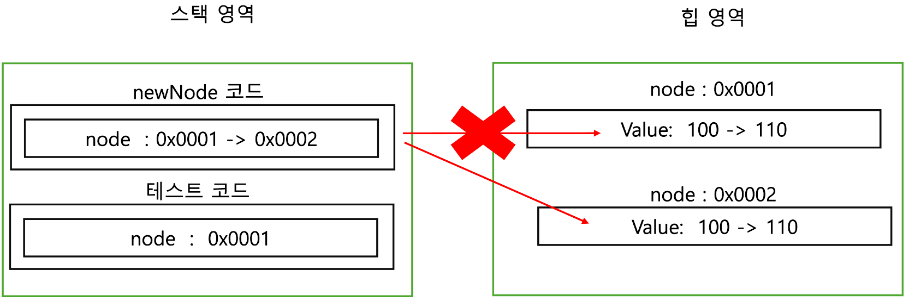
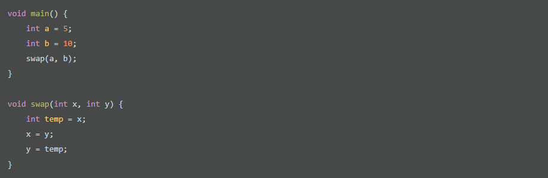
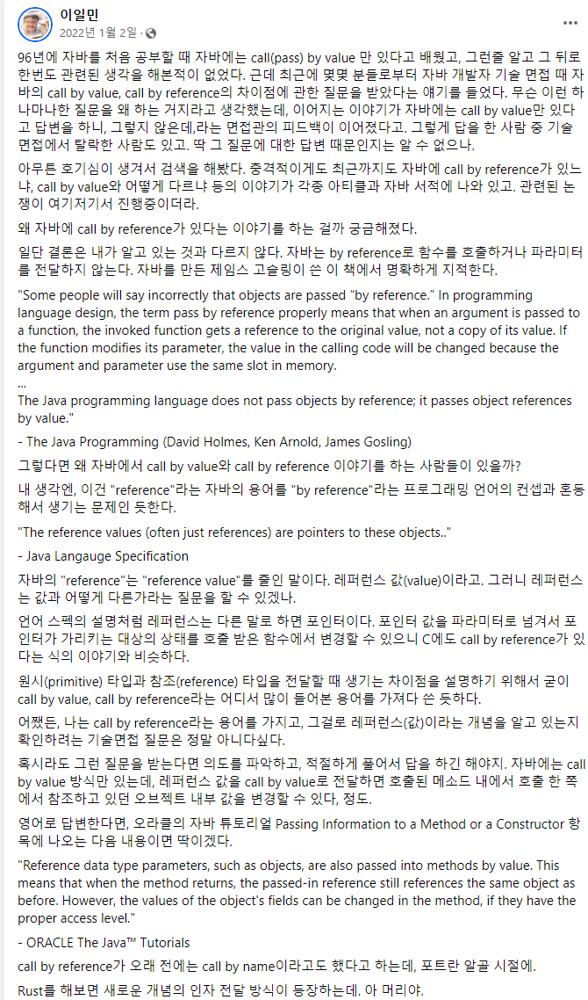

> ### 자바의 Call By Value

### Call By Value(값에 의한 호출)

함수가 호출이 될 때 메모리 공간에서는 함수를 위한 별도의 임시 공간이 생성이 된다.
해당 함수가 종료가 되면 해당 공간이 사라진다. 

그렇기 때문에 call by value 방식은 함수 호출 시 전달되는 변수 값을 복사해서 함수 인자로 전달한다.
이 때 복사된 인자는 함수 안에서 지역적으로 사용되기 때문에 local value의 속성을 가지게 된다.



그렇기 때문에 Call By Value를 지원하는 자바에서는 위와 같은 테스트가 통과함을 볼 수 있다.
분명히 함수에서 값을 바꿨지만 해당하는 값은 복사된 값을 변경한 것이므로 원본의 값은 바뀌지 않는다.

이는 스택 영역과 힙 영역을 그림으로 표현하면 다음과 같은 것이다. 애초에 둘이 가진 스택 프레임의 영역 자체가 다르다.
그리고 n_arg는 n 값만 복사를 해서 가져갔기 때문에 addValue 코드 영역의 스택 프레임의 n_arg 변수를 바꾼다고
테스트 코드의 스택 프레임 n 값이 변경되지 않는다.



그런데, 어떤 사람은 자바가 Call By Reference라고 하는 사람이 있다.
그렇게 생각하는 이유는 아래와 같은 테스트는 통과하기 때문일 것이다.



위의 테스트가 통과하는 이유는 특정한 객체에 대한 참조 값을 가지고 그 내부에 있는 값을 변경하려는 시도를 했기 때문이다.
그렇기 때문에 참조 값에 연결된 내부 값은 변경이 가능했고, 그렇기 때문에 위의 테스트 코드는 통과했다.

아래처럼 그림의 addValue 코드 내의 node는 같은 힙 영역의 0x0001이라는 주소를 참조하고 있기 때문에 이는 가능한 것이다.



그렇다면 아래의 테스트 코드는 어떻게 동작할까?? 아래의 테스트 코드의 결과는 둘의 참조 값이 다르기 때문에 False가 나온다.
왜냐하면, 복사된 참조 값이 함수 내부에서 변경이 되었다고 원본의 값이 바뀌지는 않기 때문이다.



만약에 원래 의도한 것이 내부 참조된 node를 새로운 newNode로 변경하고자 했으면 when 절을 아래와 같이 바꾸는 게 맞다.

```java
Node node = Node.newNode(node);
```

이를 스택프레임으로 똑같이 나타내보면 다음과 같다. newNode에 있는 node가 테스트 코드의 node의 주소를 복사한 값을 바꾸었다.
그렇다고 테스트 코드의 node의 주소에는 영향이 가지 않고 newNode 메서드의 스택 프레임의 주소만 바뀌게 된 것이다.



C언어도 똑같이 참조 값을 직접 넘기지 않는 이상 바뀌지 않는다. 그것과 관련된 예시로 swap 함수에서 에시가 있다.



이처럼 swap 함수를 사용해도 실제 내부 참조 값이 넘어가서 바꾸는 방식이 아니고 전달된 값은 주소가 아니라 복사된 값이기 때문에 바뀌지 않는다.

이전에 Toby님께서 페이스북에 이와 관련된 글을 남겼다고 한다. 길지만 요약을 해보면 다음과 같다.

- Call by value랑 call by reference에 대해서 왜 질문을 하는 지 모르겠다.
제임스 고슬링은 Java 프로그래밍 언어는 객체를 참조에 의해 전달하는 것이 아니다. Java는 "객체 참조를 값에 의해 전달"한다고 이야기했다.

- 이걸 물어보는 면접관은 reference 타입이라는 말과 call by reference에서 어디서 들어본 것 같다고 엮는 사람이다.
이걸 물어보는 건 좋지 못한 질문이라고 생각한다.



> ### 참고자료

https://mangkyu.tistory.com/322
https://www.facebook.com/story.php?story_fbid=pfbid0Ypifi5pNWbdmTXXkF8WdGyBDrBfB2pLAmci33bmrpZZ3bTJnihM7arRTWRX32Qjel&id=1070166746&mibextid=Nif5oz&paipv=0&eav=AfYWFZCNFiqzycgJ1lHdpdpjvCc-SYqDX5AWeSmpD9CS34sk2Pq2Ef73ckUVbUeOEWs&_rdr