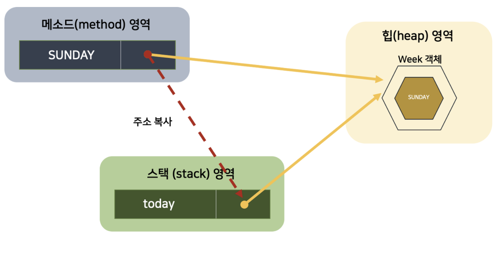

# 열거형
***
## 열겨형이란?
"상수들의 집합" => EnumType
***
## Enum을 쓰는 이유
- 가독성
- type safe
- 자체 클래스 상수와 달리 switch문에서도 사용할 수 있다.
- 싱글톤 객체
***
## Enum의 참조 방식
Enum은 특수한 클래스로서 reference 타입으로 분류가 된다. 
=> 힙 영역에 객체가 생김.

***
## Enum의 메소드
좀 쓸만한 것들을 골라와봤습니다.
~~~java

enum Season {
    SPRING,
    SUMMER,
    AUTUMN,
    WINTER
}

public class Exapmle {
    public static void main(String[] args) {
        // values(): 모든 enum 값을 배열로 반환
        for (Season season : Season.values()) {
            System.out.println(season);
        }
        /*
        SPRING
        SUMMER
        AUTUMN
        WINTER
        */

        // ordinal(): 열거형 상수의 선언 순서를 반환 (0부터 시작)
        for (Season season : Season.values()) {
            System.out.println(season + " ordinal: " + season.ordinal());
        }
        /*
        SPRING ordinal: 0
        SUMMER ordinal: 1
        AUTUMN ordinal: 2
        WINTER ordinal: 3
        */

        // valueOf(): 문자열을 해당 enum 상수로 변환
        Season summer = Season.valueOf("SUMMER");
        System.out.println("\nValueOf : " + summer);
        /*
        ValueOf : SUMMER
        */

        // compareTo(): Enum 상수의 순서를 비교 (음수, 0, 양수 반환)
        System.out.println("SPRING.compareTo(WINTER): " + Season.SPRING.compareTo(Season.WINTER));
        System.out.println("SUMMER.compareTo(SPRING): " + Season.SUMMER.compareTo(Season.SPRING));
        System.out.println("AUTUMN.compareTo(AUTUMN): " + Season.AUTUMN.compareTo(Season.AUTUMN));
        /*
        SPRING(0) - WINTER(3) = -3
        SUMMER(1) - SPRING(0) = 1
        AUTUMN(2) - AUTUMN(2) = 0
        */
    }
}
~~~
## 왜 순서가 붙어있을까?
~~~java
protected Enum(String name, int ordinal) {
        this.name = name;
        this.ordinal = ordinal;
    }
~~~
Enum은 클래스이다. 그래서 우리가 위처럼 메소드를 호출하는 방식으로 사용이 가능하다. Java에 정의된 Enum 생성자를 보면
위와 같다.
- protected : 사용자가 직접 호출 불가능, 컴파일러가 호출한다.
- name : 상수의 이름
- ordinal : 상수가 선언된 순서 
***
## Enum 매핑
~~~java
enum Period {
    MORNING("아침"),
    AFTERNOON("오후"),
    EVENING("저녁"),
    NIGHT("밤");

    private final String message;

    Period(String message) {
        this.message = message;
    }

    public String getMessage() {
        return message;
    }
}
~~~
상수가 이런 것이 되는 이유 
~~~java
public static final Period MORNING = new Period("아침");
~~~
위에서 언급했듯이 이렇게 선언이 되는 것이기 때문에 Enum은 상수 하나당 자신의 인스턴스를 만들기 때문이다. 
여기서 중요한 점은 Enum은 클래스로서 자신의 인스턴스를 만들어 static final을 통해 상수화 시킨다. 하지만 Java 사용자들을 이를 직접 new를 통해 인스턴
스화 할 수 없다. 이러한 이유는 Enum은 컴파일 시 모두 생성되기 때문이다. 따라서 위에 언급된 protected 접근제어자를 통해 다른 클래스에서
임의로 접근하여 값을 변하는 것을 막아 불변 객체로서의 역할과 싱글톤을 유지한다.

~~~java
enum Period {
    MORNING("아침") {
        @Override
        public void performOperation() {
            System.out.println("☕ 커피 한 잔을 마십니다.");
        }
    },
    AFTERNOON("오후") {
        @Override
        public void performOperation() {
            System.out.println("📚 공부하거나 일을 합니다.");
        }
    },
    EVENING("저녁") {
        @Override
        public void performOperation() {
            System.out.println("🍽️ 저녁 식사를 합니다.");
        }
    },
    NIGHT("밤") {
        @Override
        public void performOperation() {
            System.out.println("🛌 잠을 잡니다.");
        }
    };

    private final String message;

    Period(String message) {
        this.message = message;
    }

    public String getMessage() {
        return message;
    }

    // 각 Period가 수행할 동작을 정의하는 메서드 (추상 메서드)
    public abstract void performOperation();
}
~~~
또한 위와 같이 추상메서드를 이용해 각각의 Enum을 통해 단순 상수 역할에서 상수 메서드 역할을 수행할 수 있다.
***
### ※ 참고자료
* https://inpa.tistory.com/entry/JAVA-%E2%98%95-%EC%97%B4%EA%B1%B0%ED%98%95Enum-%ED%83%80%EC%9E%85-%EB%AC%B8%EB%B2%95-%ED%99%9C%EC%9A%A9-%EC%A0%95%EB%A6%AC#enum_%EC%84%A0%EC%96%B8