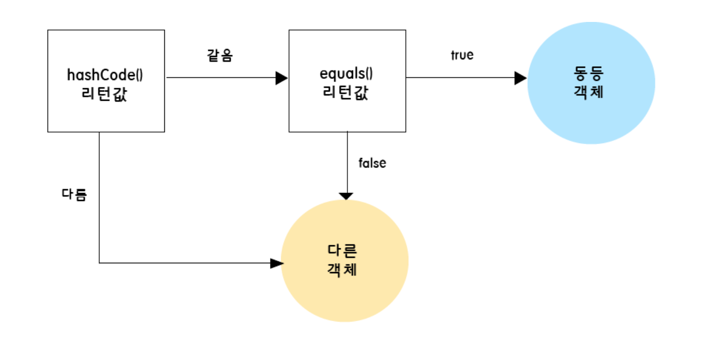

# hashCode

### 2-1. 정의

hashCode 메서드는 객체의 참조 값을 기반으로 해시 코드를 생성하는 메서드이다. 기본적으로 객체의 주소 값을 활용하지만 final 키워드가 없으므로 필요에 따라 오버라이딩할 수 있다.

### 2-2. 필요성

자바에서는 equals()의 결과가 true인 두 객체는 반드시 동일한 hashCode 값을 가져야 한다는 규약이 있다. 하지만 이러한 규약적인 관점 외에도, 실질적으로 문제가 발생할 수 있는 상황이 존재한다.

그러한 예시 중 하나로 해시 기반의 자료구조가 있다. 해시 기반의 자료구조에서는 객체의 동등성을 판단할 때 다음과 같은 과정을 거친다.

먼저 hashCode를 비교한 후, 해시 코드가 동일한 경우에만 equals를 호출하여 최종 동등 여부를 결정한다. 만약 equals()만 논리적인 비교를 수행하도록 오버라이딩했을 때, 두 객체가 논리적으로 동일하더라도 서로 다른 참조 값을 갖게 되면 hashCode가 달라져 의도와는 다르게 서로 다른 객체로 인식될 수 있다.

### **2-3. identityHashCode**

hashCode를 재정의한 상황에서 객체의 참조 값을 기반으로 한 해시 코드를 얻고자 할 때는 `System.identityHashCode(Object o)` 메서드를 사용할 수 있다. 이는 시스템 메서드이기 때문에 객체의 재정의 여부와 상관없이 일관된 값을 반환한다.