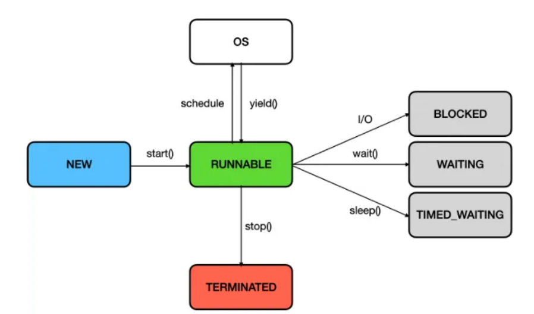
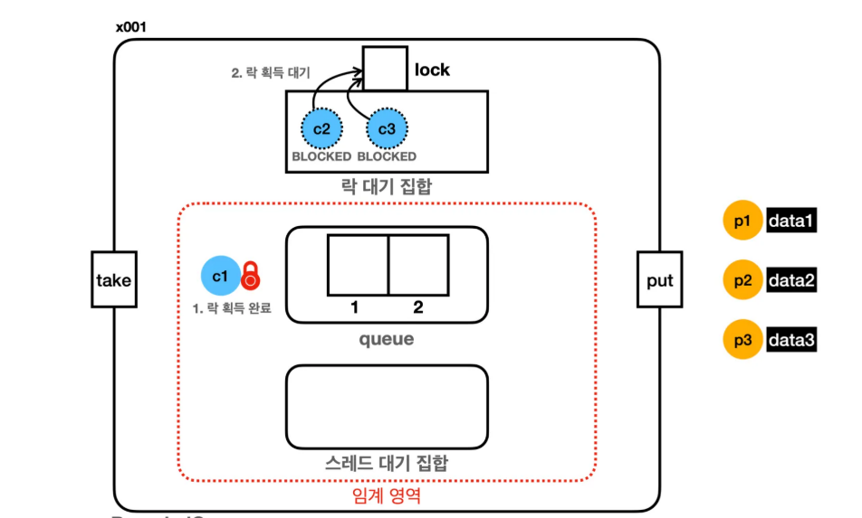
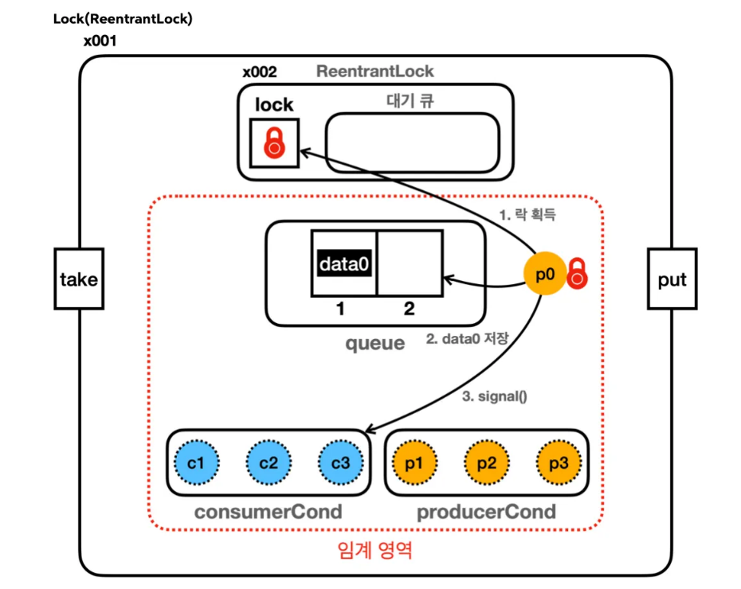

# Java Thread

## Java의 스레드는?

Java의 스레드 모델은 Native Thread로 Java의 유저 스레드를 만들면 Java Native Interface(JNI)를 통해 커널 영역을 호출하여 OS 커널 스레드를 생성하고 매핑하여 사용된다.

→ OS 스레드와 1:1 관계를 가진다.

## 생명주기



**NEW** : 스레드가 생성되고 아직 start()가 호출되지 않은 상태

**RUNNABLE** : 실행중, 혹은 실행 가능 상태

**BLOCKED** : 실행중에 synchronized 모니터락 대기 상태

**WAITING** : wait(), join()을 호출하여 일시정지된 상태

**TIMED WAITING** : sleep(long millis), wait(long timeout), join(long millis)가 호출되어 정지된 상태

**TERMINATED** : 스레드 작업이 종료된 상태

I/O가 발생하거나 Interrupt, sleep이 발생하면 BLOKED/WAITING 상태로 변한다. 이 때 Context switch가 발생하게 되고 다른 스레드가 CPU를 점유하고 실행하게 된다.

## 스레드 사용 방법

### Runnable 인터페이스 구현

```java

public class ThreadStopMainV1 {
	 public static void main(String[] args) {
		 MyTask task = new MyTask();
		 Thread thread = new Thread(task, "task");
         thread.start();
 }
 
 static class MyTask implements Runnable {
	 @Override
	 public void run() {
				//task
    }
 }
```

- Runnable 인터페이스를 구현하여 스레드를 사용할 수 있다. Thread 객체에 매개변수로 넘겨서 실행하면 된다. 이 때 실행은 반드시 `start()` 메서드를 통해 해야한다.
    - `run()` 메서드로 실행하게 되면 메인 스레드에서 맴버함수 `run()` 을 호출하는 것과 같다. (새로 스레드 콜스텍이 생기는 것이 아님.)
    - `start()` 로 호출하면  JVM이 콜 스택을 새로 만들고 실행하게 된다.

### Thread 클래스를 상속

```java
public class MyThread extends Thread {
    public MyThread() {}

    @Override
    public void run() {
			// task
    }
}
```

- Thread 클래스를 상속받아서 스레드를 사용할 수 있다.
    - Thread를 상속받기 때문에 다른 클래스를 상속받을 수 없다.
    - 일반적으로 Runnable 인터페이스를 구현하는 방식을 많이 사용한다.

## 인터럽트

- 인터럽트를 사용하면 Waiting, Timed_Waiting 상태의 대기 상태 스레드를 깨워서 Runnable 상태로 만들 수 있다.
- 인터럽트를 발생시키면 받는 스레드에 `InterruptedException`이 발생한다.
    - 이를 catch로 잡아서 정상 흐름으로 처리하면 된다. (interrupt를 받으면 바로 Runnable 상태로 넘어가고 catch에서 정상 흐름으로 돌린다)

-) 무조건 즉각 `InterruptedException`이 발생하는게 아니라 **sleep()** 처럼 `InterruptedException`을 던지는 메서드를 호출하거나 호출 중일 때 예외가 발생한다.

ex)

- interrupt() 를 호출하면 받는 스레드의 인터럽트 상태(true)가 된다. 이 상태에서 sleep() 같은 InterruptException을 발생시키는 메서드를 호출하거나 호출 중이면 InterruptedException 발생한다.
- 스레드의 인터럽트 상태를 false로 바꾼다.
- Thread.currentThread().isInterrupted() → 현재 인터럽트 상태를 반환 (값은 변경시키지 않는다.)
    - 반드시 인터럽트를 발생시키고 다시 인터럽트 상태를 false로 바꿔줘야 한다.
    - 그렇지 않으면 추후에 InterruptedException을 던지는 모든 메서드에서 인터럽트가 계속 발생한다.
- Thread.interrupted() : 이 메서드를 호출하면 인터럽트 상태가 true면 true를 반환하고 상태를 false로 바꾼다. 아니라면 false를 반환한다.

## yield

- 특정 스레드가 크게 바쁘지 않은 상황이어서 다른 스레드에 CPU 자원을 양보하고 싶을 때 사용한다.
- sleep(1000)을 사용해서 Timed_Waiting 상태로 넘어가서 일시적으로 자원을 양보할 수 있다. 하지만 이 방식의 경우 양보할 스레드가 없는 경우에 아무도 없는데 양보하는 현상이 발생한다.
    - RUNNABLE → TIMED_WAITING → RUNNABLE 로 변환 과정이 길다.
- Java의 Runnable 상태는 OS 스케줄링 상에서 Running, Ready 상태를 가질 수 있다. (Java에서는 구분 불가)
    - yield는 RUNNABLE 상태를 유지하면서 CPU 양보, 즉 Ready 상태로 바꾸는 것이다.
    - 강제가 아니라 힌트로 동작한다.

## 메모리 가시성 문제

### 정의

멀티 스레드 환경에서 한 스레드가 변경한 값이 다른 스레드에서 어느 시점에 보이는지에 대한 문제를 메모리 가시성 문제라고 한다.

### 문제

메모리에 접근해서 값을 읽는 것보다 CPU에 있는 캐시에서 데이터를 읽고 쓰는게 빠르다. 각 코어마다 캐시가 있어서 여기에서 우선적으로 값을 일고 쓰게 된다. (성능)

이러한 이유로 공유 자원의 값을 바꾸고 읽을 때 CPU 캐시에 값을 쓰고 읽게 되면 다른 스레드에서 변경한 값을 읽지 못할 수 있다. (메로리에 반영되는 시점이 CPU 설계마다 다르기 때문)

### 해결방법

CPU에 값을 읽거나 쓰지 말고 메모리에 값을 쓰고 읽으면 된다. 성능상으로 좋지 않기 때문에 제한적으로만 사용하는 것이 좋다. (대략 5배의 성능 손해)

- Java에서는 **volatile** 키워드를 붙이면 CPU 캐시를 안거치고 메모리에서 값을 읽고 쓴다.

## 동기화 메커니즘

### Synchronized

Synchronized를 사용하면 임계영역을 손쉽게 설정할 수 있도록 해준다.

### 문제점

단점으로는 하나의 스레드에서 모니터락을 획득하면 다른 스레드는 BLOCKED 상태로 무한대기하게 된다. (타임아웃이 없고 중간에 인터럽트 불가능)

그리고 순서대로 처리되는게 아니라 무작위로 대기중인 스레드중 하나가 락을 획득하기 때문에 공정성이 보장되지 못하고 특정 스레드는 오랜 시간동안 락을 획득하지 못 할 수도 있다. (공정성 문제)

### LockSupport

스레드를 BLOCKED가 아닌 **WAITING** 상태로 변경한다.

- `park()` : 스레드를 WAITING 상태로 변경한다.
- `parkNanos(nanos)` : 나노초동안 TIMED_WAITING 상태로 변경한다.
- `unpark(thread)` : WAITING 상태의 대상 스레드를 RUNNABLE 상태로 변경한다.

Synchronized의 문제는 BLOCKED 상태로 변해서 타임아웃이 존재하지 않다는 것이다. 이는 무기한 대기로 이어질 수 있다. LockSupport를 사용하면 WAITING 상태로 변하기 때문에 외부의 도움을 받아 깨어날 수 있다. 그리고 WAITING된 스레드는 인터럽트를 통해서도 깨어날 수 있다.

LockSupport는 너무 저수준의 API이기 때문에 Lock 인터페이스, ReentrantLock 구현체로 Wrapping되어 제공된다.

### Lock 인터페이스

- lock() vs lockInteruptibly()
    - 락 대기중에 인터럽트 가능 여부가 다르다.
- tryLocK() : 락 획득을 시도하고 바로 결과를 리턴한다.
- tryLock(long time, TimeUnit unit) : 주어진 시간동안 락을 대기하고 중간에 인터럽트 발생하면 락 획득 포기한다.
- unlock() : 락을 해제하는 기능으로 락을 획득한 스레드가 호출한다. 다른 스레드에서 호출하면 IllegalMonitorStateException이 터진다.

## Producer - Consumer Problem

### 한정된 버퍼(Bounded buffer) 문제

데이터가 가득 찬 상황에 데이터를 넣거나 데이터가 없는 상황에 데이터를 꺼낼 때 문제가 발생한다.

### 단순 반복 처리

반복문으로 생산, 소비스를 처리하게 되면 락을 가진 스레드가 락을 놔주지 않아서 심각한 문제가 발생할 수 있다.

ex) 문제 상황. (여기서의 Lock은 큐에 대한 락)

- 큐가 가득찬 상태에서 producer가 생산을 하려고 할 때 Lock을 반납하지 않고 반복문으로 대기하면 다른 어떤 스레드에서도 큐에 접근할 수 없고 무한 대기가 발생한다.
- 큐가 빈 상태에서 consumer가 소비하려고 할 때 Lock을 반납하지 않고 반복문으로 생산되기를 기다리면 다른 어떤 스레드에서도 큐에 접근할 수 없고 무한 대기가 발생한다.

### Object - wait, notify

**Object.wait()** : 현재 스레드가 가진 락을 반납하고 WAITING 상태로 들어간다.

* synchronized 또는 메서드에서 락을 소유하고 있는 경우 호출 가능하다.
* 다른 스레드에서 notify(), notifyAll()을 호출할 때까지 대기한다.
* RUNNABLE → WAITING 상태로 변경된다.

**Object.notify()** : 대기중인 스레드를 하나 깨운다.

* synchronized 블록이나 메서드에서 호출되어야 한다. 깨운 스레드는 다시 락을 획득할 기회를 얻는다.

**Object.notifyAll()** : 대기중인 스레드를 모두 깨운다.

* 마찬가지로 synchronized 블록 메서드에서 호출되어야 한다. 
* 모든 스레드가 락을 획득할 기회를 얻는다. 
* 모든 스레드를 깨워야 하는 경우에 사용된다.

**wait set (대기 집합)** : 대기 상태에 들어간 스레드를 관리하는 것을 말한다. 모든 객체에서 wait set을 가진다.

→ 모든 객체는 락(모니터 락) + wait set을 쌍으로 가진다.

문제점 : notify()가 work set에서 깨우는 스레드가 랜덤이기 때문에 결과는 제대로 나오지만 비효율적으로 동작하는 경우가 있다. 
* 하나의 work set에서 생산자, 소비자 스레드를 모두 관리하면서 문제가 발생한다.
* JVM 구현에 따라 다르고 일반적으로는 FIFO로 동작한다.
* 어떤 스레드가 깨어날지 알 수 없기 때문에 기아 문제가 발생할 수 있다.

notifyAll()을 사용하여 문제 해결

* 기아 문제는 막을 수 있지만 비효율은 막지 못한다.
* 다 깨어났을 때 같은 종류 (생산-생산, 소비-소비)가 먼저 락을 잡고 다른 스레드가 BLOCKED 되면 비효율적인 동작이 발생한다.

### Lock Condition

생산자, 소비자용 집합을 분리하여 소비자는 생산자를 깨우고 생산자는 소비자를 깨우도록 하면 위의 문제를 해결할 수 있다. (Lock, ReentrantLock을 활용해서 구현 가능)

```java
private final Condition condition = lock.newCondition();

condition.await(); // Object.wait()에 대응
condition.signal(); // Object.notify()에 대응
```

ReentrantLock을 사용하면 condition이 스레드 대기 공간이 된다.

### 락 대기 집합 (Synchronized)



BLOCKED 상태의 스레드들은 락 대기 집합에 들어가게 된다. 이는 자바 내부에 구현되어 있고 모니터락과 같이 개발자가 접근할 수 없다. 이는 Wait set과는 다른 set이다.

→ 자바의 모든 객체 인스턴스는 멀티스레드와 임계 영역을 다루기 위해서 내부에 3가지 요소를 가진다.

1. 모니터 락
2. 락 대기 집합
3. 스레드 대기 집합

Synchronized 락

1. 모니터 락 획득 대기 - 자바 내부 락 대기 집합에서 대기한다 (BLOCKED 상태), synchronized 를 시작할 때 락을 획득 못한 경우
2. wait() 대기 - wait()을 호출했을 때 객체 내부 스레드 대기 집합에서 대기한다 (WAITING) 상태), notify() 가 호출되면 나온다.

### ReentrantLock 대기 집합



ReentrantLock

1. ReentrantLock 획득 대기 - 대기 큐에서 WAITING 상태로 락을 대기한다. lock.lock()을 호출했을 때 락이 없으면 대기한다. lock.unlock() 호출 시 대기가 풀리고 락 획득 시도.
2. await() 대기 - condition.await() 호출 시 condition 객체 스레드 대기 공간에서 대기한다. 다른 스레드가 condition.signal() 호출 시 대기 공간에서 나온다.

## CAS 연산

* Compare-and-swap(set) 명령어로 하드웨어에 의해서 원자적으로 연산을 처리한다.
* 값을 비교하고 같으면 변경한다. (다르면 실패)

일반적으로 AtomicInteger를 사용하면 synchronized, Lock을 사용하는 경우보다 1.5~2배 정도 성능이 좋다.

### CAS vs Lock 방식

* 락 (Lock) 방식은 비관적 접근으로 데이터에 충돌이 발생할 것을 가정한다.
* CAS 방식은 낙관적 접근으로 충돌이 잘 없을 것이라 가정하고 충돌이 발생하면 재시도를 한다.
* 충돌이 많으면 Lock, 없으면 CAS로 처리한다. (CAS는 간단한 경우에만 사용 가능)
* CAS로 락을 구현하는 경우 SpinLock 방식을 구현하게 되는데 이동안 CPU 자원을 낭비하고 있기 때문에 대기 시간이 극히 짧은 (Context Switch 보다 짧은) 경우에 사용하면 좋고 아니라면 Lock을 사용하는게 좋다.
* Lock은 RUNNABLE → BLOCKED, WAITING → RUNNABLE 로 돌아오기 때문에 비용이 크다.
* Lock 방식의 경우 CPU를 사용하지 않고 대기할 수 있다. (Spin Lock과 대조적)