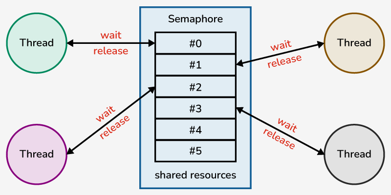

## 1. 동기화 이론
- 여러 프로세스/스레드가 동시에 실행될 때, 공유 데이터의 일관성을 유지하기 위해 동기화가 필요하다.
- 동기화를 수행하기 위해 하나의 메서드에, 동시에, 딱 하나의 스레드만 진입해서 실행하는 조건 (mutual exclusion) 을 구현하였다.

### Mutual Exclusion

- 임계 영역(Critical Section) 을 만들고, Lock을 획득한 스레드만 임계 영역에 들어가서 작업을 수행하도록 만든다.
- Lock을 획득하기 위해 여러 스레드는 경합을 하고, 획득한 하나의 스레드가 영역에 진입할 수 있다.
- 수행 이후 임계영역을 나갈 때, Lock을 반환한다.
- 이 때, 한 스레드가 임계 영역에 진입하기 위해 무제한으로 대기하는 상황이 생기지 않게 해야 한다. `starvation`

## 2. Mutex와 Semaphore 개념

### Mutex

**기본 개념**
- Mutex(뮤텍스)는 *Mutual Exclusion*(상호 배제)의 약자로, 임계 영역에 한 순간에 하나의 스레드만 접근할 수 있도록 보장하는 동기화 객체이다. 
- 즉, 특정 공유 자원이나 코드 블록을 보호하여 동시에 둘 이상의 스레드가 해당 부분을 실행하지 못하게 막아서, 데이터의 일관성과 무결성을 유지한다.

**구현 원리**
- 스레드가 락을 획득하려고 할 때, 만약 다른 스레드가 이미 보유한 상태라면 락이 해제(unlock)될 때까지 스레드가 대기 상태로 머무른다. 
- Mutex를 성공적으로 획득한 스레드는 임계 영역의 코드를 실행하며, 작업을 완료한 후에는 Mutex를 해제하여 대기 중인 다른 스레드에게 락을 넘긴다. 
- 이 과정에서 항상 한 시점에 하나의 스레드만 임계 영역에 들어갈 수 있게 되어 상호 배제가 구현된다.


### Semaphore

**기본 개념**
- Semaphore(세마포어)는 공유 자원에 **동시에 접근할 수 있는 스레드의 수를 제한**하는 카운터 기반 동기화 객체이다. 
- 세마포어는 내부적으로 허용된 최대 동시 접근 스레드 수(permit 개수)를 나타내는 카운터를 유지하며, 이 수를 초과하여 스레드들이 임계 영역에 진입하지 못하도록 제어한다. 
- 예를 들어, 세마포어를 3으로 초기화하면 최대 3개의 스레드까지 동시에 임계 영역을 실행할 수 있고, 네 번째 이후의 스레드는 자원이 해제될 때까지 기다리게 된다.


**구현 원리**
- 세마포어는 초기화 시 지정한 값만큼의 permit을 갖는다. 스레드가 세마포어를 **획득** `acquire()` 하면 세마포어의 카운터가 1 감소하고, 만약 남은 퍼밋이 0이라면 추가로 진입하려는 다른 스레드는 퍼밋이 반환될 때까지 대기(blocking)한다. 

- 임계 영역에서 작업을 마친 스레드는 세마포어를 **반납** `release()` 하여 퍼밋 카운터를 1 증가시키고, 대기 중인 스레드 중 하나가 깨어나 자원에 접근할 수 있게 된다. 이 방식으로 세마포어는 동시에 접근하는 스레드의 수를 제한, 조정 한다.





## 3. 이를 Java에서 어떻게 구현하는지

### Mutex

- Synchronized
    - `Synchronized` 키워드는 Java에서 기본 제공하는 동기화 방법이다.
    - 메서드나 특정 블록에 적용하면, 해당 객체의 모니터락(Monitor Lock)을 획득한 스레드만 임계영역에 진입할 수 있다.
        
        ```java
        public class SynchronizedCounter {
            private int count = 0;
        
            // 메서드 전체 적용 (객체의 모니터 락 획득)
            // 같은 객체의 여러 스레드가 동시에 이 메서드를 실행하지 못하도록 보장
            public synchronized void increment() {
                count++;
            }
            
            // 블록 동기화 예시
            // 동기화 블록을 이용해 특정 코드 영역만 보호
            public void decrement() {
                synchronized (this) {
                    count--;
                }
            }
            
            public int getCount() {
                return count;
            }
        }
        ```
        
- ReentrantLock
    - `ReentrantLock`은 `java.util.concurrent.locks.Lock` 인터페이스의 구현체로, 보다 세밀한 락 제어 (ex. 공정성, 타임아웃, 조건 변수 등) 를 제공한다.
    - 재진입 가능한 락이라는 특성 상, 보다 복잡하고 세밀한 락 획득과 반납에 대한 구현이 가능하다.
    - 이미 락을 획득하고 있는 스레드만 재진입을 허용하는 매커니즘으로, 같은 스레드가 여러 번 락을 요청해도 블록되지 않고, 내부적으로 횟수를 관리한다.


### Semaphore

- Semaphore
    - `Semaphore`는 동시에 접근할 수 있는 스레드 수(permit)를 제한한다. (하나의 스레드가 아니라 여러 스레드가 동시에 접근할 수 있는데, 그 수를 제한하는 것)
    - 예를 들어, permit이 3으로 설정된 Semaphore는 동시에 최대 3개의 스레드만 임계영역에 진입할 수 있다.
    - permit도 AQS 내부 `volatile int state` 로 관리된다.
        
        ```java
        public class Semaphore implements java.io.Serializable {
            private static final long serialVersionUID = -3222578661600680210L;
            /** All mechanics via AbstractQueuedSynchronizer subclass */
            private final Sync sync;
        
            /**
             * Synchronization implementation for semaphore.  Uses AQS state
             * to represent permits. Subclassed into fair and nonfair
             * versions.
             */
            abstract static class Sync extends AbstractQueuedSynchronizer {
                private static final long serialVersionUID = 1192457210091910933L;
                
                Sync(int permits) {
                    setState(permits); 
                    //AQS 내부 setState를 통해 volatile int state = permits 으로 초기화한다.
                }
        
                final int getPermits() {
                    return getState();
                }
                
                // 기본적으로 nonfair라서 스레드가 경합할 때 순서를 따로 보장해주지 않는다.
                // 극단적으로 가면 기아현상의 문제가 있어서 순서가 꼭 보장되어야 할때는 fair 옵션을 주는게 좋다.
                // fair는 접근 순서를 따로 관리하는 FIFO Queue를 만들어서 관리하기 때문 (대신 관리 비용 있음) 
                final int nonfairTryAcquireShared(int acquires) {
                    for (;;) {
                        int available = getState();
                        int remaining = available - acquires;
                        if (remaining < 0 ||
                            compareAndSetState(available, remaining)) // CAS 연산을 통해 원자성 보장
                            return remaining;
                    }
                }
             }
         }
        ```
        

- Semaphore를 활용해서 부모 스레드와 자식 스레드 간의 실행 순서를 제어할 수도 있다.
    - 예를 들어, 부모 스레드가 자식 스레드가 어떤 작업을 완료할 때까지 기다리도록 하고 싶을 때,
    - 부모 스레드는 permit이 0인 Semaphore에서 `acquire()`를 호출해 블로킹 상태에 들어가고, 자식 스레드는 작업을 마친 후 `release()`를 호출하여 부모 스레드가 진행하도록 만들면 된다.
    
    ```java
    import java.util.concurrent.Semaphore;
    
    public class ParentChildSemaphoreExample {
        public static void main(String[] args) throws InterruptedException {
            // 초기 permit이 0인 Semaphore 생성 (부모 스레드가 대기)
            Semaphore semaphore = new Semaphore(0);
    
            Thread childThread = new Thread(() -> {
                System.out.println("자식 스레드: 작업 시작");
                // 작업 시뮬레이션 (예: 2초 대기)
                try {
                    Thread.sleep(2000);
                } catch (InterruptedException e) {
                    Thread.currentThread().interrupt();
                }
                System.out.println("자식 스레드: 작업 완료, semaphore 해제");
                // 작업 완료 후 semaphore 해제 -> 부모 스레드가 진행할 수 있음
                semaphore.release();
            });
    
            childThread.start();
    
            System.out.println("부모 스레드: 자식 스레드 완료 대기중...");
            // 부모 스레드는 자식 스레드가 작업 완료하여 semaphore를 해제할 때까지 대기
            semaphore.acquire();
            System.out.println("부모 스레드: 자식 스레드 완료 후 실행 계속");
        }
    }
    ```
    

- `new Semaphore(0)`로 초기 permit 수를 0으로 설정하면, 부모 스레드는 `acquire()` 호출 시 바로 대기 상태에 들어가게 된다.
- 자식 스레드는 자신의 작업을 수행한 후 `semaphore.release()`를 호출하여 permit을 증가시킨다.
- 부모 스레드는 `acquire()`를 통해 permit이 1 이상이 될 때까지 대기하고, 자식 스레드가 release를 호출하면 permit을 획득하고 실행을 계속하게 된다.

### 이진 세마포어

- 0과 1의 두 가지 값만을 갖는 세마포어이다.
- 잠금과 해제를 통해 하나의 프로세스나 스레드만이 공유 자원에 접근할 수 있도록 하는데, 뮤텍스와 유사한 기능을 한다.
- But 뮤텍스와 “소유권” 과 “용도”에 따른 차이점이 존재한다.
    - **소유권**
        - **Mutex**: 락을 획득한 스레드가 소유권을 가지며, 반드시 해당 스레드만 락을 해제할 수 있다.
        - **Binary Semaphore**: 단순히 0과 1의 값을 가지기만 할 뿐, 소유권 개념이 없어서 어떤 스레드든지 release 할 수 있다.
    - **용도**
        - **Mutex**: 주로 상호배제를 위해 사용되며, 한 스레드만 공유 자원에 접근하도록 보장하는 용도이다.
        - **Binary Semaphore**: 상호배제뿐만 아니라, **이벤트 신호 전달, 실행 순서 제어** 등에도 활용될 수 있다.


---


자바 언어 차원에서 제공되는 `synchronized`, `ReentrantLock`, `Semaphore` 등은 **단일 JVM 프로세스 내부**에서만 유효한 동기화 수단이다. 즉, **한 개의 애플리케이션 인스턴스(한 개의 JVM) 안에서 스레드들이 공유 자원에 접근할 때**만 동작한다. 따라서, 단일 인스턴스 안에서 로컬 동기화가 필요한 상황에서 사용한다.

분산 환경에서 동일한 자원(ex. 데이터, 파일, 캐시)에 동시에 접근해야 하는 경우가 생길 때는 다중 인스턴스 간 동시 접근을 제어하기 위해 분산락을 사용한다.