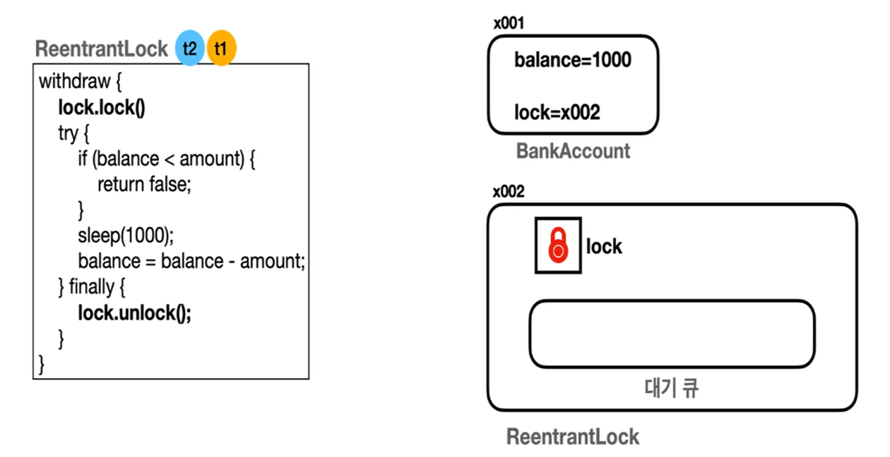

# ReentrantLock

## 1. 정의

대표적인 임계 영역 관리 방법 중 하나인 `synchronized`는 다음과 같은 두 가지 문제점을 갖는다.

1. **무한 대기**
    
    `BLOCKED` 상태의 스레드들이 락이 풀릴 때까지 무한정 대기한다. 특정 시간까지만 대기하도록 타임아웃을 걸거나 중간에 인터럽트할 수 없다.
    
2. **공정성**
    
    `BLOCKED` 상태의 여러 스레드 중 임의의 스레드가 다음에 락을 획득하게 된다. 따라서 특정 스레드가 오랜 기간 락을 획득하지 못하는 기아 상태에 빠질 수 있다.
    

이러한 문제를 해결하기 위해 자바 1.5부터는 `Lock` 인터페이스를 제공한다. `Lock`을 사용하면 임계 영역을 더욱 안전하게 관리할 수 있으며, 대표적인 구현체로 `ReentrantLock`이 있다. 최근 자바 버전에서 `synchronized`와 `ReentrantLock` 간의 성능 차이는 거의 없지만, 락 획득 타임아웃이나 인터럽트 가능성, 공정성 모드와 같은 세부적인 제어가 필요한 경우에는 `ReentrantLock`을 사용하는 것이 좋다.

`ReentrantLock`은 내부적으로 락과 대기 큐를 사용해 임계 영역을 관리한다. 또한 하나의 스레드가 이미 락을 획득한 상태에서 다시 같은 락을 중첩해서 획득할 수 있다. 스레드가 재진입할 때마다 내부의 카운트가 증가하고, `unlock()`을 호출할 때마다 카운트를 감소시켜 카운트가 0이 되면 락을 완전히 해제한다.

또한 `ReentrantLock`을 사용할 때는 try-finally 블록 내에서 `unlock()`을 수행하는 것이 좋다. 이를 통해 락을 획득한 스레드가 작업하는 도중에 예외가 발생하더라도 반드시 락을 해제하도록 해 교착 상태를 방지할 수 있다.

## 2. 메서드

`ReentrantLock`는 `synchronized`보다 더 다양하고 유연한 메서드들을 제공한다. `tryLock()`나 `tryLock(long time, TimeUnit unit)`와 같은 메서드를 통해 무한 대기 문제도 해결할 수 있다.

### 2-1. `void lock()`

락 획득을 시도한다. 만약 다른 스레드가 락을 획득한 상황이라면 락이 해제될 때까지 대기 상태가 된다. 만약 대기 상태에서 인터럽트가 발생하면 순간 대기 상태를 빠져나오지만 `lock()` 메서드 내에서 해당 스레드를 강제로 다시 대기 상태로 만들어버린다. 이를 통해 마치 인터럽트를 무시하는 것처럼 동작한다.

### 2-2. `void lockInterruptibly()`

락 획득을 시도한다. `lock()` 메서드와는 다르게 인터럽트가 가능하다. 만약 다른 스레드가 락을 획득한 상황이라면 락이 해제될 때까지 대기 상태가 된다. 대기 중에 인터럽트가 발생하면 `InterruptedException`이 발생하고 락 획득을 포기한다.

### 2-3. `boolean tryLock()`

락 획득을 시도하고 즉시 성공 여부를 반환한다. 만약 다른 스레드가 락을 획득한 상황이라면 `false`를 반환하고, 그렇지 않으면 락을 획득한 뒤 `true`를 반환한다.

### 2-4. `boolean tryLock(long time, TimeUnit unit)`

주어진 시간 동안만 락 획득을 시도한다. 주어진 시간 내에 락을 획득하면 `true`를 반환하고, 그렇지 않으면 `false`를 반환한다. 대기 중에 인터럽트가 발생하면 `InterruptedException`이 발생하고 락 획득을 포기한다.

### 2-5. `void unlock()`

락을 해제하고, 락 획득을 대기 중인 스레드가 있다면 그 중 하나가 락을 획득할 수 있도록 한다. 반드시 락을 획득한 스레드가 해당 메서드를 호출해야 하며, 그렇지 않을 경우 `IllegalMonitorStateException`가 발생한다.

### 2-6. `Condition newCondition()`

`Condition` 객체를 생성하여 반환한다. `Condition`은 락과 함께 사용하며, 스레드가 특정 조건이 충족될 때까지 대기하거나 다른 스레드에게 조건이 충족되었음을 알릴 때 사용한다. `await()` 메서드를 통해 조건이 만족될 때까지 락을 잠시 해제하고 스레드를 대기 상태로 만들 수 있다. 그리고 조건이 충족되면 `signal()` 또는 `signalAll()` 메서드를 통해 대기 중인 스레드를 다시 깨울 수 있다.

## 3. 모드

`ReentrantLock`는 비공정 모드와 공정 모드 2가지 모드로 사용할 수 있다.

### 3-1. 비공정 모드

`ReentrantLock`는 기본적으로 비공정 모드로 동작한다. 이 모드에서는 락이 해제되었을 때, `synchronized`와 마찬가지로 대기 큐에 있는 스레드 중 임의의 스레드가 락을 획득하게 된다. 이는 기아 현상이 발생할 수 있다는 단점이 있지만 스레드의 락 획득 순서에 대한 처리가 필요 없어 락을 획득하는 속도가 빠르다. 따라서 스레드 간의 공정성보다 성능이 중요할 때는 비공정 모드를 사용한다.

### 3-2. 공정 모드

`new ReentrantLock(true)`로 락을 생성하면 공정 모드로 사용할 수 있다. 공정 모드에서는 대기 큐가 선입선출 구조로 동작한다. 즉, 먼저 락을 요청한 스레드가 먼저 락을 획득하게 된다. 이를 통해 공정성을 보장할 수 있지만 락의 요청 순서 관리와 같은 추가적인 처리가 필요하기 때문에 성능이 저하될 수 있다.