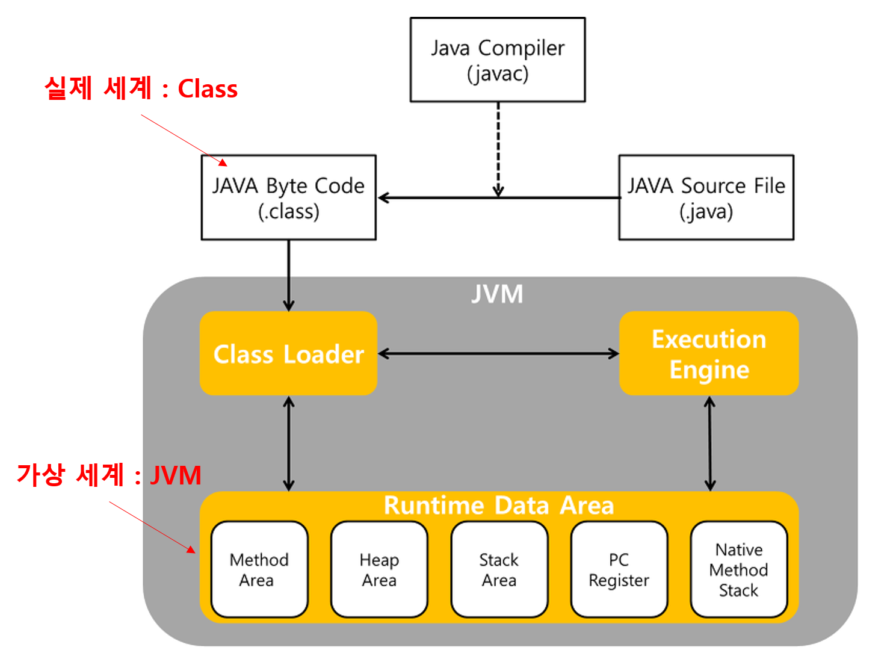

> ### 리플렉션이란?

리플렉션은 코드의 거울상과 같은 것이다. 리플렉션을 지원하는 자바에선 실제 코드 부분과 가상 세계의 데이터
리플렉션이 존재한다.

그렇다면 실체는 무엇이고 가상 세계는 어디일까?라는 질문을 할 수도 있다. 실체는 Class이고 거울은 JVM 메모리의 영역이다.
그림으로 나타내면 아래와 같이 표현을 할 수 있다. 



리플렉션으로 된 Method Area에 속하는 JVM 속의 데이터는 런타임에 생성이 되고 동작을 한다.
그래서 리플렉션에 대해서 설명을 할 때에는 런타임에 클래스와 인터페이스 등을 검사하고 조작할 수 있는 기능이라고 한다.
또한, 프로그램 실행 중에 사용자와 운영체제 및 기타 프로그램과 상호작용하면서 클래스와 인터페이스 등을 검사하고 조작하는 기능이라고 한다.

중요한 건, 컴파일 시점이 아니라 런타임 시점에 변경을 하기 위함이다. 그러면, Reflection으로 사용할 수 있는 Class 객체는 어떻게 얻을 수 있을까?
총 3가지 방법이 있다.

- Object.getClass()로 얻는 방법
- .class 리터럴로 얻는 방법
- Class.forName()으로 얻는 방법이 있다.

우선 Class에 대한 설명을 우선적으로 하고 Class 객체를 얻는 방법에 대한 설명과 마지막으로는 이걸 활용해서 무엇을 할 수 있을까에 대해서 정리해보고자 한다.

> ### Class

Class 클래스는 java.lang.Class 패키지에 별도로 존재하는 독립형 클래스로서, 자신이 속한 클래스의 모든 멤버 정보를 담고 있기 때문에
런타임 환경에서 동적으로 저장된 클래스나 인터페이스 정보를 가져오는데 사용이 된다.

자바의 모든 클래스와 인터페이스는 컴파일 후에 .java -> .class 파일로 변환이 된다. 
이 때, .class 파일에 담기는 내용은 멤버 변수, 메서드, 생성자 등 객체 정보들이 들어있으며 클래스 로더는
이 정보들을 가져와 힙 영역에 자동으로 객체화시킨다. 그래서 Class.class는 따로 명시하지 않아도 가져올 수 있다.

위의 정보 중 중요한 부분은 멤버 변수, 메서드, 생성자들의 정보를 얻어올 수 있다는 점이다.
영한씨의 강의를 보면 리플렉션을 통해 얻을 수 있는 부분들을 아래와 같이 정의를 하고 있다.

- 클래스와 메타데이터 : 클래스 이름, 접근 제어자, 부모 클래스, 구현된 인터페이스
- 필드 정보 : 필드의 이름, 타입, 접근 제어자를 확인하고 해당 필드의 값을 읽거나 수정하는 것이 가능
- 메서드 정보 : 메서드 이름, 반환 타입, 매개 변수 정보를 확인하고 동적으로 메서드를 호출
- 생성자 정보 : 생성자의 매개변수 타입과 개수를 확인하고, 동적으로 객체를 생성할 수 있음.

참고로 필드 정보 내용을 보면 동적으로 런타임에 읽기만 해오는 게 아니라 변경이나 조작도 가능함을 알 수 있다.

> ### Class에 접근하는 방법

아래의 3가지 방법을 통해서 클래스 정보를 얻어올 수 있다.

```java
public static void main(String[] args) throws ClassNotFoundException {
    // 1. 클래스로 얻기
    Class<String> classClass = String.class;
    System.out.println("classClass: " + classClass);

    // 2. 인스턴스에서 얻기
    String string = new String("Hello World");
    Class<? extends String> instanceClass = string.getClass();
    System.out.println("instanceClass: " + instanceClass);

    // 3. forName으로 스트링으로 얻기
    String className = instanceClass.getName();
    Class<?> dataClass = Class.forName(className);
    System.out.println("dataClass: " + dataClass);
}
```

클래스를 가지고 오면 클래스를 가지고와서 이런 정보도 얻을 수 있다.
해당 클래스의 명칭은 무엇인지 패키지는 어디인지, 어떤 종류의 클래스인지 등의 정보들을 전부 가져올 수 있다.

```java
public static void main(String[] args) throws ClassNotFoundException {
    Class<String> stringClass = String.class;

    System.out.println("stringClass.getName(): " + stringClass.getName());
    System.out.println("stringClass.getSimpleName(): " + stringClass.getSimpleName());
    System.out.println("stringClass.getPackageName(): " + stringClass.getPackageName());

    System.out.println("stringClass.getSuperclass(): " + stringClass.getSuperclass());
    System.out.println("stringClass.getInterfaces(): " + Arrays.toString(stringClass.getInterfaces()));

    System.out.println("stringClass.isInterface(): " + stringClass.isInterface());
    System.out.println("stringClass.isEnum(): " + stringClass.isEnum());
    System.out.println("stringClass.isAnnotation(): " + stringClass.isAnnotation());
}
```

클래스 내부에서는 메서드 정보를 내부에서 정의된 메서드들과 상위 클래스에서도 정의된 메서드들도 포함해서 확인할 수 있다.

```java
public static void main(String[] args) throws ClassNotFoundException {
    Class<String> stringClass = String.class;

    // String 클래스의 부모 상위 클래스에도 정의된 모든 메서드의 시그니처들에 대해서 확인이 가능
    System.out.println("========= methods() ===========");
    Method[] methods = stringClass.getMethods();
    for (Method method : methods) {
        System.out.println(method);
    }

    // String 클래스에만 정의된 메서드의 시그니쳐만 확인이 가능
    System.out.println("========= declaredMethods() ===========");
    Method[] declaredMethods = stringClass.getDeclaredMethods();
    for (Method declaredMethod : declaredMethods) {
        System.out.println(declaredMethod);
    }
}
```

결과적으로는 다음처럼 메서드 시그니처 확인이 가능하다.(접근 제어자, static, 리턴 타입, 메서드 명, 패키지명, 파라미터 타입 등)

```java
public void java.lang.String.getChars(int,int,char[],int)
public int java.lang.String.compareTo(java.lang.String)
public int java.lang.String.compareTo(java.lang.Object)
public int java.lang.String.indexOf(int)
```

다음처럼 필드도 확인이 가능하다. 필드의 확인은 다음과 같이 아래에 코드로 작성하면 된다.

```java
public static void main(String[] args) throws ClassNotFoundException {
    Class<String> stringClass = String.class;

    // 상위 클래스에도 존재하는 Field까지 모두 조회
    Field[] fields = stringClass.getFields();
    for (Field field : fields) {
        System.out.println("field.getName(): " + field.getName());
    }

    // 현재 클래스에서 존재하는 Field만 조회
    Field[] declaredFields = stringClass.getDeclaredFields();
    for (Field declaredField : declaredFields) {
        System.out.println("declaredField.getName(): " + declaredField.getName());
    }
}
```

얻은 필드를 통해서 값을 바꾸는 것도 가능한데, private으로 선언된 클래스의 필드도 setAccessible(true)를 통해서
직접 값을 바꿀 수 있다.

```java
public static void main(String[] args) throws ClassNotFoundException, NoSuchFieldException, IllegalAccessException {
    Name name = new Name("멀티캠퍼스");
    System.out.println("Before: name.getName() - "  + name.getName());

    Class<? extends Name> nameClass = name.getClass();
    Field nameField = nameClass.getDeclaredField("name");

    nameField.setAccessible(true);
    nameField.set(name, "빨리탈출하자.");
    System.out.println("After: name.getName() - "  + name.getName());
}

static class Name {
    private String name;

    Name(String name) {
        this.name = name;
    }

    public String getName() {
        return name;
    }
}
```

또한, 생성자 정보도 얻어올 수 있다. 다음처럼 Constructor를 얻어오고 이걸 통해서 객체를 생성하는 것도 가능하다.

```java
public static void main(String[] args) throws ClassNotFoundException, NoSuchFieldException, IllegalAccessException {
    Class<Name> nameClass = Name.class;

    System.out.println("====== constructor() =======");
    Constructor<?>[] constructors = nameClass.getConstructors();
    for (Constructor<?> constructor : constructors) {
        System.out.println(constructor);
    }

    System.out.println("====== declaredConstructor() =======");
    Constructor<?>[] declaredConstructors = nameClass.getDeclaredConstructors();
    for (Constructor<?> declaredConstructor : declaredConstructors) {
        System.out.println(declaredConstructor);
    }
}

static class Name {
    private String name;

    Name() {
    }

    Name(String name) {
        this.name = name;
    }

    public String getName() {
        return name;
    }
}
```

이제 생성자를 통해서 새로운 객체를 한번 만들어보자. 생성자의 파라미터로 동일한 걸 찾아서 반환한 다음 해당 생성자로 만들면 instance 생성이 가능하다.

```java
public static void main(String[] args) throws NoSuchMethodException, InvocationTargetException, InstantiationException, IllegalAccessException {
    Class<Name> nameClass = Name.class;

    System.out.println("====== constructor() =======");
    Constructor<?> constructor = nameClass.getDeclaredConstructor(String.class);
    constructor.setAccessible(true);
    Object instance = constructor.newInstance("hello");
    System.out.println(instance);
}

static class Name {
    private String name;

    Name() {
    }

    Name(String name) {
        this.name = name;
    }

    public String toString() {
        return name;
    }
}
```

위의 사실을 통해서 우리가 특정 라이브러이를 사용할 떄에 기본 생성자를 요구하는 것들도 우리는 미래에 생길 클래스에
어떤 필드가 생성될 지 모르고 앞으로 생성될 필드의 타입이 무엇인지도 모른다. 그러니 모두가 동일한 기본 생성자를 받아서 일단 객체를 만든 다음
Field를 받아와서 리스트로 돌면서 해당 값으로 채우는 방식을 선택하게 된 것이다.

리플렉션이 미래에 생길 클래스에 대해서 런타임 시점에서 조작을 할 수 있게 하는 장점이 있다 .그래서 많은 프레임워크나 라이브러리에서
리플렉션의 기능을 활용해서 코드를 작성하게 해준다.

또한 인텔리제이의 자동완성이나 애노테이션 같은 주석 정보에서 정보를 가져와 활용하는 것에서도 리플렉션을 사용해서 이를 처리한다.

하지만, 이에 대해서는 보안적인 취약점, 코드 복잡도 증가, 성능 저하 등의 여러 가지 이유로 문제가 있다.
테스트 코드에서 내부 값을 확인하는 부분에서도 리플렉션을 통해서 getter가 없는데도 private 필드로 된 값을 가져와 확인하는 등
이런 경우에 이게 맞는 지에 대해서 스택오버플로우 등에서는 굉장히 논의가 많은 걸로 안다.

아무튼 클래스의 JVM에 들어간 메타데이터 정보를 읽어서 런타임에 클래스의 인스턴스를 조작하는 리플렉션 정도로 기억만 해주고 넘어가도 좋을 것 같다.

> ### 출처

- https://www.youtube.com/watch?v=RZB7_6sAtC4&t=209s
- https://www.youtube.com/watch?v=67YdHbPZJn4
- https://inpa.tistory.com/entry/JAVA-%E2%98%95-%EB%88%84%EA%B5%AC%EB%82%98-%EC%89%BD%EA%B2%8C-%EB%B0%B0%EC%9A%B0%EB%8A%94-Reflection-API-%EC%82%AC%EC%9A%A9%EB%B2%95